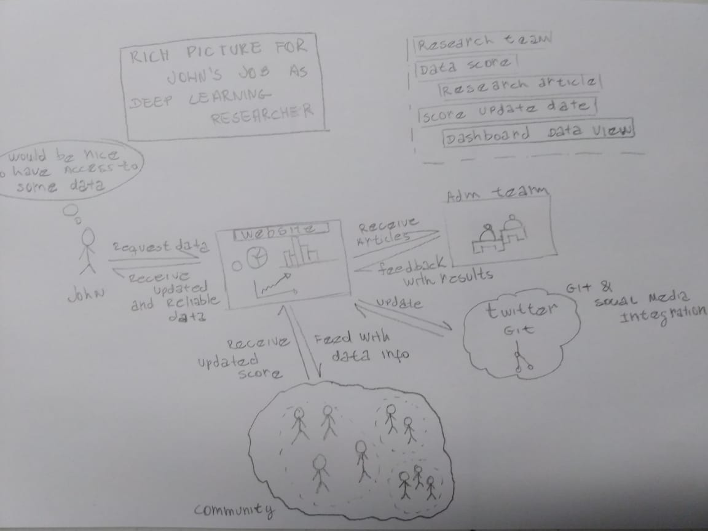
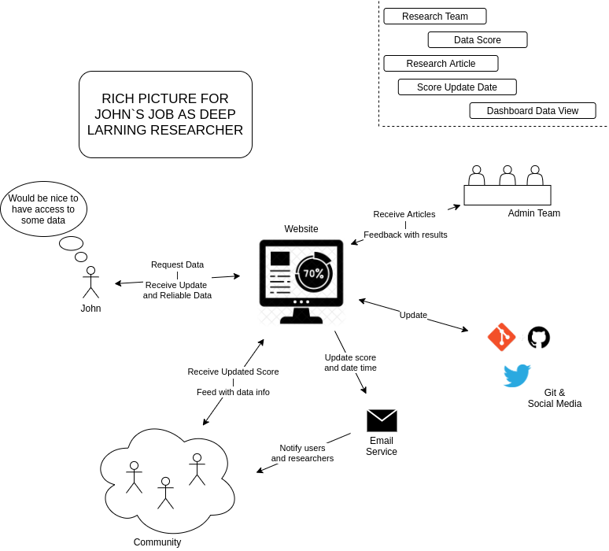

#RichPicture

Rich Picture is an artifact that contains a fast and objective design. The goal is to express a desire for character and activity.

The source of this rich image is a brainstorm with the development team.

## Rich Pictures

#### Handmade Rich Picture

#### Digital Rich Picture

---
## References
---
- **[Moodle]** Serrano, Milene. Vídeo Aula : RichPicture.

***
## Revision History
---

| Data | Autor | Description | Version |
|------|-------|-----------|--------|
| 02/09/2020 | Vitor Meireles | Creating the document and adding the handmade Rich Picture | 1.0 |
| 03/09/2020 | Vitor Meireles |  Addition of digital version and some improvements | 1.1 |
