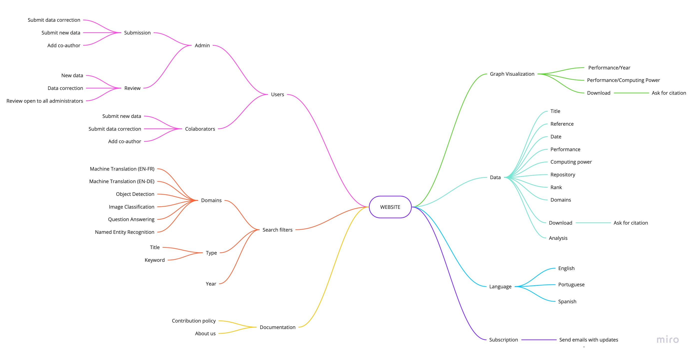

# Mind Map

A mind map is a diagram used to visually organize information. A mind map is hierarchical and shows relationships among pieces of the whole. It is often created around a single concept, drawn as an image in the center of a blank page, to which associated representations of ideas such as images, words and parts of words are added. Major ideas are connected directly to the central concept, and other ideas branch out from those major ideas.

For this project we created a mind map based on the group brainstorm.

**Author** : Gabriel Filipe & Guilherme Deusdará 
**Version:** 0.1 

**Author** : Gabriel Filipe & Guilherme Deusdará 
**Version:** 1.0 

 

---
## References
---
- **[Moodle]** Serrano, Milene. Vídeo Aula : Mapa Mental.
- **[WebSite]** <a href="dt">https://en.wikipedia.org/wiki/Mind_map</a>

***
## Versioning of this page
---

| Data | Autor | Description | Version |
|------|-------|-----------|--------|
| 03/09/2020 | Gabriel Filipe & Guilherme Deusdará | Creating the page and adding first version | 0.1 |
