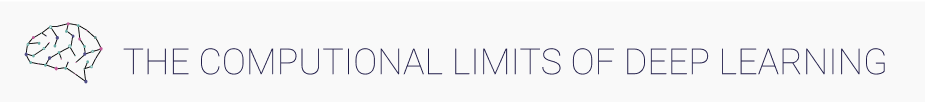

#Prototype

The prototype was made using Figma. The prototype is important for the testing and requirements gathering phase. Provides an overview of how the project will be developed before the actual code development

Figma is software for developing prototypes and creating designs that does not need installation because it is available in the clouds through a web page. It has features for design, prototyping, systems design, collaboration and download. The prototypes have interactions, advanced transitions with intelligent animations, animated GIFs, among others, which allow an experience very close to the real world. It allows quick sharing of the prototype to others and facilitates the contribution.

The Protype is avaiable for navegation in  [TLCDL - Figma!](https://www.figma.com/proto/eDPefFCFvVwSj13AD7RqVs/TLCDL?node-id=106%3A2&scaling=min-zoom)

## Prototype versioning
---
|    Date    | Author(s) |             Description             |    Version    |
|------------|---------|-------------------------------------|-------------|
|  09/07/2020| Lorrany Azevedo, Mikhaelle bueno, Gabriel Filipe | Create project and start Home ,Login and About Us | 0.1 |
|  09/08/2020| Lorrany Azevedo, Mikhaelle bueno, Gabriel Filipe | Start change password, sing up and benchmark | 0.2 |
|  09/09/2020| Lorrany Azevedo, Mikhaelle bueno, Gabriel Filipe | Start admin and collaborator page, domain and user survey page | 0.3 |
|  09/10/2020 | Lorrany Azevedo, Mikhaelle bueno, Gabriel Filipe | Start admin and collaborator home, admin submission and review page | 0.4 |