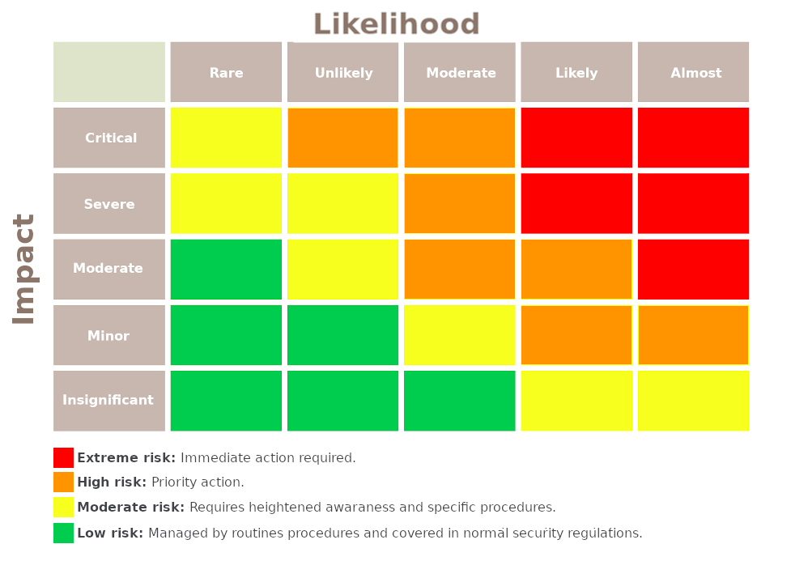
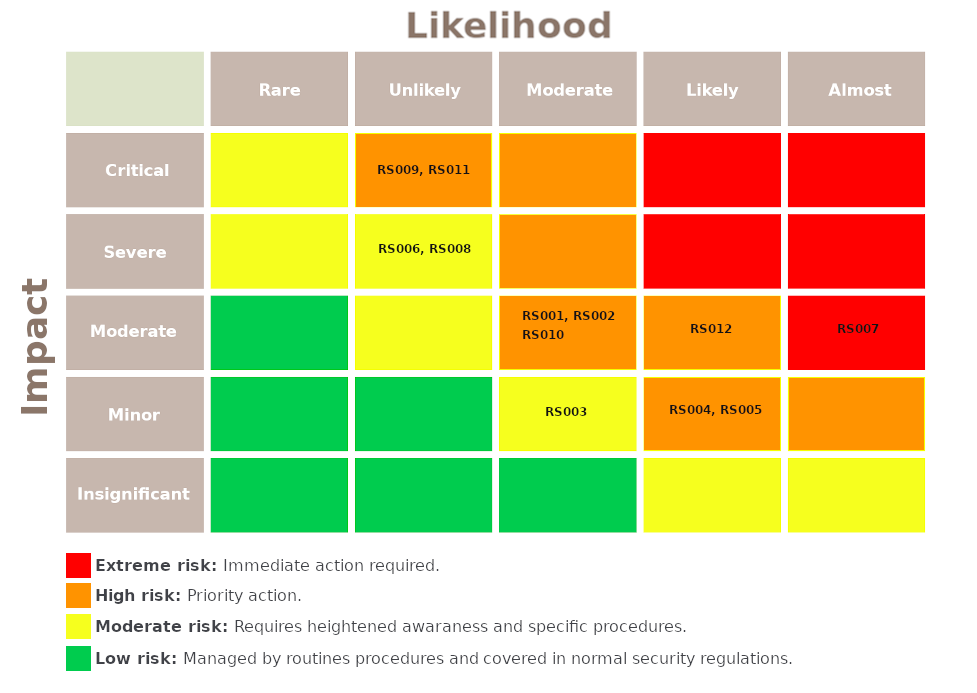

# Risk Plan

In the estimate the risks of this project, it was decided to establish a standard for the assessment of _probability x impact_, also serving to prioritize risks. See tables bellow:

| Likelihood (L)         | Weight |
|------------------------|--------|
|Rare (< 3%)	         |       1|
|Unlikely (3% - 10%)     | 	     2|
|Moderate (10% - 50%)    |	     3|
|Likely (50% - 90%)      |	     4|
|Almost certain (> 90%)  |	     5|

| Impact (I)         | Weight |
|--------------------|--------|
|Insignificant       |	     1|
|Minor	             |       2|
|Moderate	         |       3|
|Severe	             |       4|
|Critical	         |       5|

 

 

At the beginning of each sprinch, each risk is calculated based on the tables presented before. At every new iteration a known and well-mitigated risk in previous sprints always tends to decrease. Knowing this, risks identified during the project tend to have a high impact and need immediate action.

Follows the table for identified risks:

|    id|                                Risk|                                                                                                 Risk response|
|------|------------------------------------|--------------------------------------------------------------------------------------------------------------|
| RS001|                    Team integration|                 Provide constant feedback to facilitate communication and the constant monitoring of members;|
| RS002|                     Team commitment| Increase the sense of integration between members;   Treat individually with the member;   Communicate with the teacher in extreme cases|
| RS003| Temporary unavailability of members|                                         Warn of setbacks and maintain effective communication between members|
| RS004|            Withdrawal of discipline| Constant communication between the members;   Transparency with team members;   Scope replanning to match remaining productivity capacity|
| RS005|                  Delays in meetings| Schedule meetings in advance to avoid hitting schedules with other members' appointments;   Individual conversation;                                                                                                           |
| RS006|                        Scope change| Constant feedback with the MIT team, through meetings;   Search for new alternatives for eliciting requirements|
| RS007|                   Environment setup|                                     Assist the member with difficulty in setting up the machine; Using Docker|
| RS008|                 Architecture change|                                    Creates a resilient and adaptable architecture that is prepared for change|
| RS009|                Services integration|                                                                               Study the service documentation|
| RS010|                 Continuous delivery|                                                                                               Define pipeline|
| RS011|              Continuous integration|                                                                                               Define pipeline|
| RS012|                Technical difficulty|       Constant and effective communication between members  Choosing tools that have a good learning curve|

 

 

---
## References
---
- **[Moodle]** Serrano, Milene. Vídeo Aula : Plano de Riscos.

---

## Document Versioning

| Date | Author(s) | Description | Version |
|------|-------|-----------|--------|
| 09/06/2020 | Ygor Galeno | Document creation | 0.1 |
| 09/07/2020 | Ygor Galeno | Finish document | 0.2 |