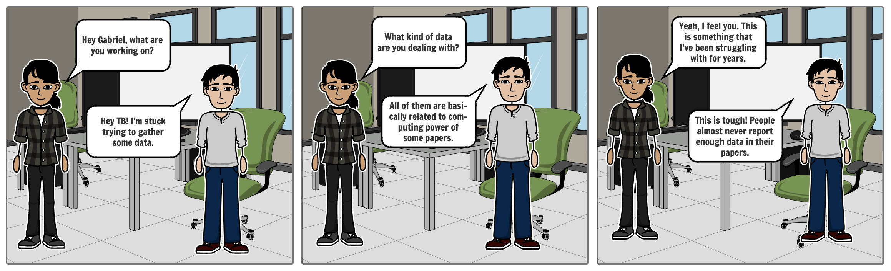
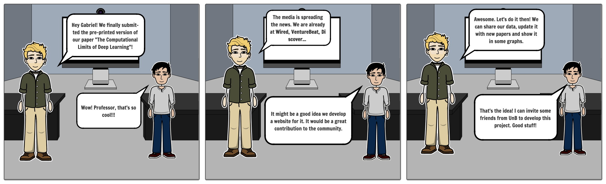
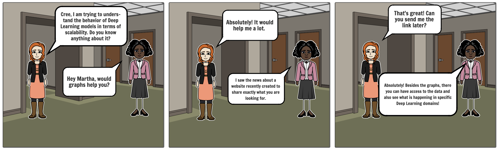

# Story Board

A storyboard is a graphic organizer that consists of illustrations or images displayed in sequence for the purpose of pre-visualising a motion picture, animation, motion graphic or interactive media sequence. The storyboarding process, in the form it is known today, was developed at Walt Disney Productions during the early 1930s, after several years of similar processes being in use at Walt Disney and other animation studios.

---

### Conversation with TB about the lack of data report

**Author** : Gabriel Filipe 
**Version:** 1.0 

***

### Conversation with Neil about the website creation

**Author** : Gabriel Filipe 
**Version:** 1.0 

***

### Conversation between Cree and Martha about data accessibility

**Author** : Gabriel Filipe 
**Version:** 1.0 

---
## References
---
- **[WebSite]** <a href="dlc">https://www.storyboardthat.com/pt</a>
- **[WebSite]** <a href="dlc">https://en.wikipedia.org/wiki/Storyboard</a>
***

## Versioning of this page
---

| Date | Author(s) | Description | Version |
|------|-------|-----------|--------|
| 07/07/2020 | Gabriel Filipe | Creates the page and adds TB conversation | 1.0 |
| 08/07/2020 | Gabriel Filipe | Adds Neil conversation | 1.1 |
| 09/07/2020 | Gabriel Filipe | Adds Cree conversation | 1.2 |