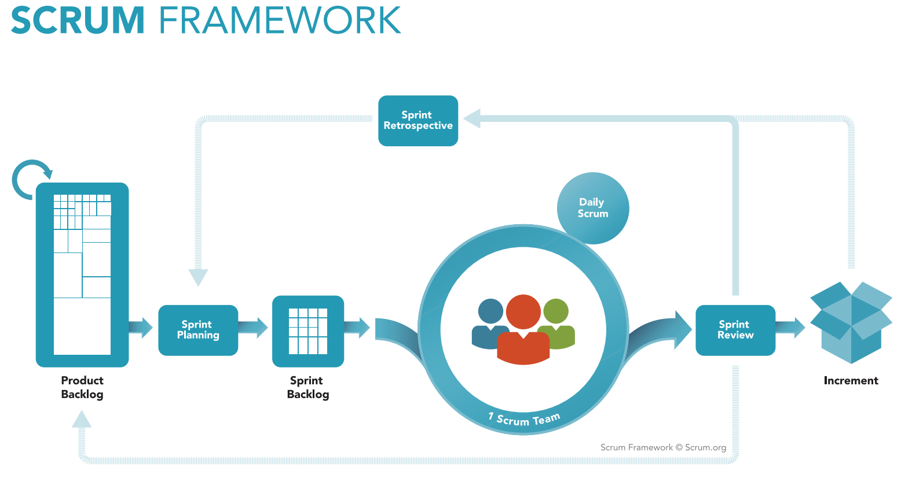
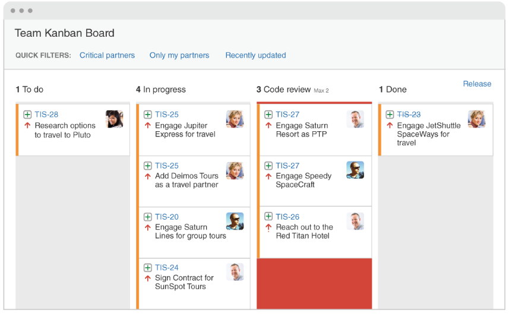

# Methodology

In this project, the group chooses to follow a combination of methodologies. The chosen ones are: Scrum, XP, Kanban.
Of course that only a share of each one of them were used, those which better fits with the project and development situation.

## Scrum

According with the creators and maintainers of the methodology and their website, Scrum is a framework that helps teams work together. Scrum itself is a simple framework for effective team collaboration on complex products. This definition consists of Scrum’s roles, events, artifacts, and the rules that bind them together.
Much like a rugby team (where it gets its name) training for the big game, Scrum encourages teams to learn through experiences, self-organize while working on a problem, and reflect on their wins and losses to continuously improve.

For this project we going to use some rotated posts from scrum as PO, SM, developers and sprints, besides de backlog product.

## XP

Extreme Programming is a popular agile process. It has already proven to be very successful in many companies of all sizes and sectors around the world.
This process is successful because it emphasizes customer satisfaction. Instead of delivering everything you could possibly want at a distant date in the future, this process provides the software you need as needed. Extreme Programming allows its developers to respond with confidence to changes in customer requirements, even at the end of the life cycle.

At this project XP is present in our planning time, listening and focus at client satisfation. For the group this will increse the feedback number and final project quality.

## Kanban

Kanban is a popular framework used to implement Agile software development. It requires real-time capacity communication and full transparency of work. Work items are represented visually in a Kanban board, allowing team members to see the status of each part of the job at any time.

At this project we used ZenHub plug-in tho help us with the _to_ _do_ board with the tasks that we going to do during each sprint.

---
## References
---
- **[Moodle]** Serrano, Milene. Vídeo Aula : Scrum.
- **[WebSite]** <a href="dt">https://www.atlassian.com/agile/scrum</a>
- **[WebSite]** <a href="dt">https://www.scrum.org/resources/what-is-scrum</a>

- **[Moodle]** Serrano, Milene. Vídeo Aula : XP.
- **[WebSite]** <a href="dt">http://www.extremeprogramming.org/</a>

- **[Moodle]** Serrano, Milene. Vídeo Aula : Kanban.
- **[WebSite]** <a href="dt">https://www.atlassian.com/br/agile/kanban</a>

***
## Document Versioning
---

| Date | Author(s) | Description | Version |
|------|-------|-----------|--------|
| 09/10/2020 | Guilherme Deusdará, Vitor Meireles | Creates the page and adds Scrum | 1.0 |
| 10/10/2020 | Vitor Meireles | Add Xp and Kanban info | 1.1 |