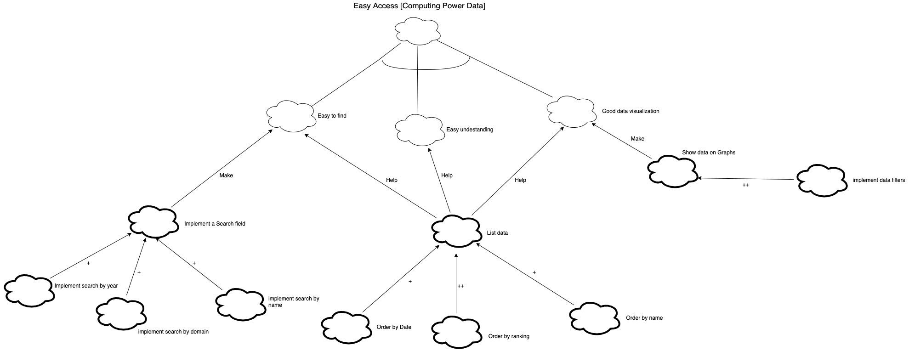

# NFR Framework

The NFR Framework helps developers deal with non-functional requirements (NFRs) during software development. The Framework helps developers express NFRs explicitly, deal with them systematically, and use them to drive the software development process rationally.

**Author** : Guilherme Deusdará 
**Version:** 0.1 

 

---
## References
---
- Chung L., Nixon B.A., Yu E., Mylopoulos J. (2000) The NFR Framework in Action. In: Non-Functional Requirements in Software Engineering. International Series in Software Engineering, vol 5. Springer, Boston, MA

***
## Versioning of this page
---

| Data | Autor | Description | Version |
|------|-------|-----------|--------|
| 03/09/2020 | Guilherme Deusdará | Creates page and adds first version | 0.1 |

