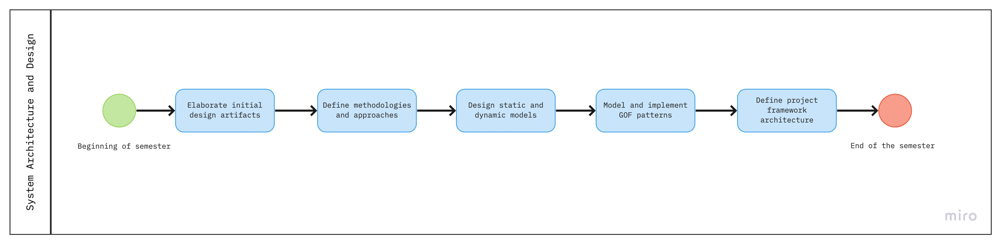
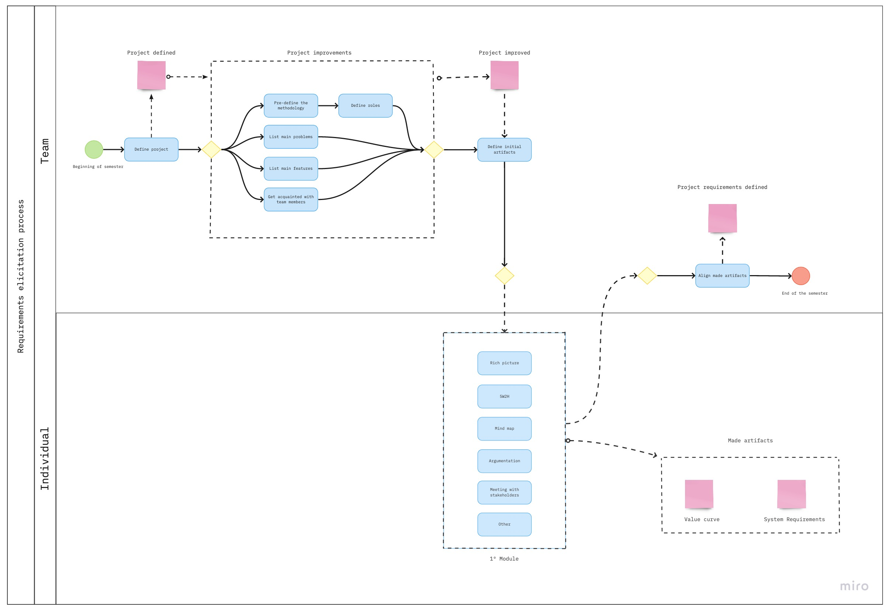
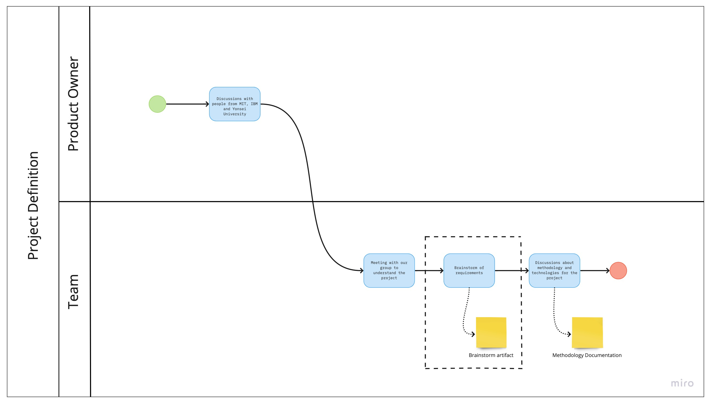
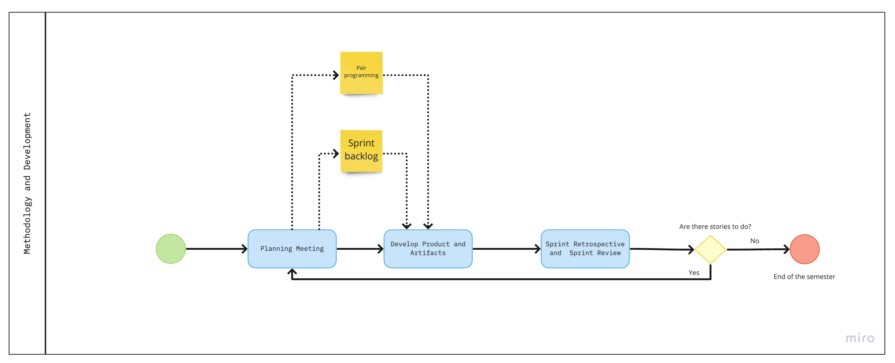
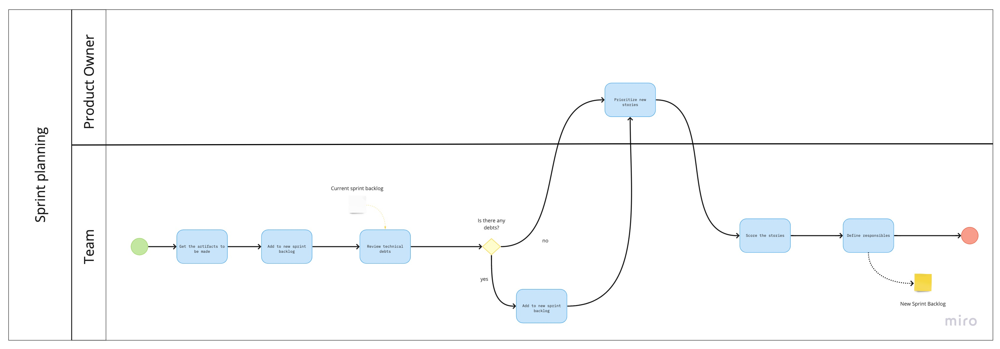
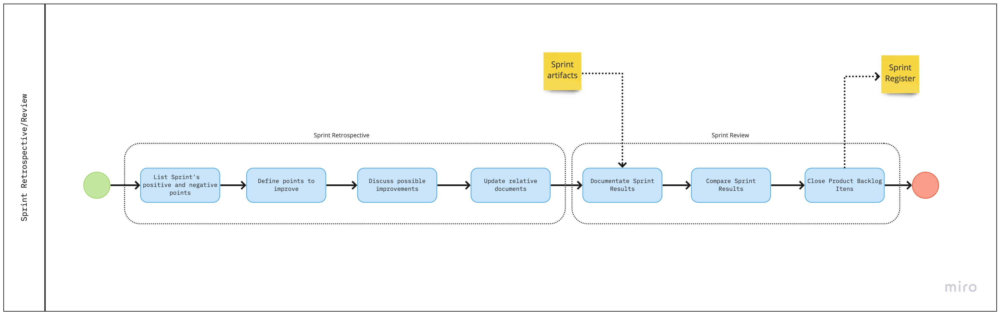
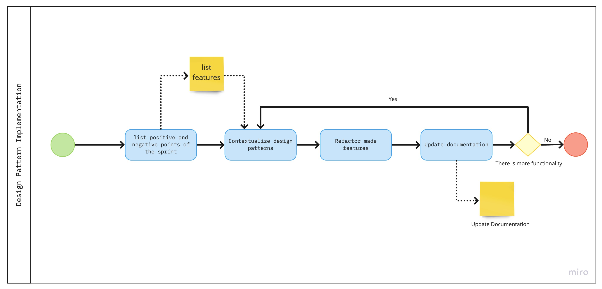
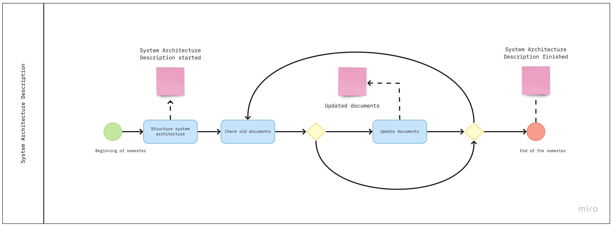

# Modeling of Methodologies

## Description

To carry out the discipline of Architecture and Software Design, it was decided to perform the BPMN modeling considering the whole discipline and its intermediary deliverables. For this, it was modeled using Bizagi software following BPMN standards. As the project is in its initial stages, some stages were not developed due to lack of knowledge of the team through subsequent stages of the discipline, but they will be developed before the stage occurs.

---

## General Modeling

**Author** : Gabriel Filipe 
**Version:** 1.0 

***

## PROCESS - Initial Elaboration of Artifacts

**Author** : Gabriel Filipe 
**Version:** 1.0 

***

## SUBPROCESS - Project Definition

**Author** : Guilherme Deusdará 
**Version:** 1.0 

***

## SUBPROCESS - Development Methodology

**Author** : Mikhaelle Bueno 
**Version:** 1.0 

***

## SUBPROCESS - Sprint Planning

**Author** : Guilherme Deusdará 
**Version:** 1.0 

***

## SUBPROCESS - Sprint Retrospective/Review

**Author** : Mikhaelle Bueno 
**Version:** 1.0 

***

## SUBPROCESS - Design Pattern Implementation

**Author** : Mikhaelle Bueno 
**Version:** 1.0 

***

## PROCESS - System Architecture Description

**Author** : Gabriel Filipe 
**Version:** 1.0 

# References

- FLOWERS, Robert; EDEKI, Charles. Business Process Modeling Notation. International Journal of Computer Science and Mobile Computing, [s. l.], v. 2, p. 35 – 40, 1 mar. 2013 (https://pdfs.semanticscholar.org/5ef9/417be5caaebd3e2a2445e2262968c19d3976.pdf) 
- TRIBUNAL DE CONTAS DA UNIÃO. Curso de Mapeamento de Processos de Trabalho com BPMN e Bizagi. [S. l.: s. n.], 2013.

# Document Versioning
---

| Date | Author(s) | Descrição | Versão |
|------|-------|-----------|--------|
| 09/10/2020 | Gabriel Filipe |  General Modeling| 0.1 |
| 09/10/2020 | Gabriel Filipe |  PROCESS - Initial Elaboration of Artifacts| 0.1 |
| 09/10/2020 | Gabriel Filipe |  System Architecture Description| 0.1 |
| 09/10/2020 | Guilherme Deusdará |  SUBPROCESS - Project Definition | 0.1 |
| 09/10/2020 | Guilherme Deusdará |  Sprint Planning | 0.1 |
| 09/10/2020 | Mikhaelle Bueno |  SUBPROCESS - Development Methodology | 0.1 |
| 09/10/2020 | Mikhaelle Bueno |  Sprint Retrospective/Review | 0.1 |
| 09/10/2020 | Mikhaelle Bueno |  SUBPROCESS - Design Pattern Implementation | 0.1 |