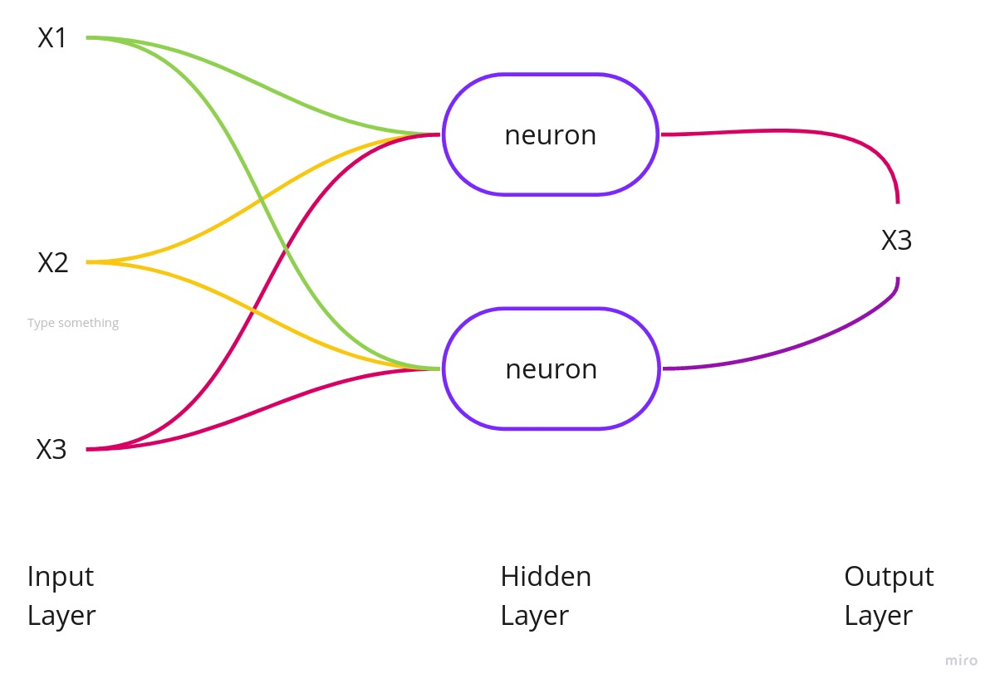

# Glossary

### **<a href="#ac">Accuracy</a>**

**Author** : Lorrany Azevedo 
**Version:** 0.1 

|   |   |
|---|---|
|**Description:**| In the context of **<a href="#ml"> machine learning </a>**, accuracy refers to the percentage of correct **<a href="#pre"> predictions </a>** that a model obtained after training a data set. |
|**Synonym:**| error rate|
|**Example:** | In the below example we have an input with two dogs and two cats. Our model classified our input data set as three dogs and one cat. So the accuracy of our model is 2/4 = 0.5% or 50%.|
|   |  | 

### **<a href="#ann">Artificial Neural Network</a>**

**Author** : Lorrany Azevedo 
**Version:** 0.1 

|   |   |
|---|---|
|**Description:**| An artificial neural network is a computational structure that tries to mimic the biological neural networks of animals, ANN'S are made up of nodes that mimic the neurons of a biological brain.  |
|**Synonym:**| ANN |
|**Example:**|  |

### **<a href="#ai">Artificial Intelligence</a>**

**Author** : Lorrany Azevedo 
**Version:** 0.1 

|   |   |
|---|---|
|**Description:**| **<a href="#ai">Artificial Intelligence</a>** (**<a href="#ai">AI</a>**) is a broad branch of computer science that is concerned with designing an intelligent compartment in agents that can be diverse (computers, cars, etc.).  **<a href="#ai">Artificial Intelligence</a>** seeks to understand the processes of the human mind and tries to make these agents have intelligent behavior, which in turn involves reasoning, learning and other behaviors associated with human intelligence. |
|**Synonym:**| AI, computational intelligence |

### **<a href="#cp">Computational Power</a>**

**Author** : Lorrany Azevedo 
**Version:** 0.1 

|   |   |
|---|---|
|**Classification:**| Data processing capacity, also known as cpu power, this processing power involves aspects of hardware and computational architecture. |
|**Synonym:**| computing capacity, processing capacity |

### **<a href="#dnn">Deep Neural Network</a>**

**Author** : Lorrany Azevedo 
**Version:** 0.1 

|   |   |
|---|---|
|**Description:**| Deep neural networks are artificial neural networks (**<a href="#ann">ANN</a>**) with many layers between an input layer and an output layer, give them the name **<a href = "#dnn">DNN</a>**.|
|**Synonym:**| DNN |
|**Example:**|  (Image Font: <a href="https://blog.dataiku.com/when-and-when-not-to-use-deep-learning#:~:text=One%20of%20the%20main%20advantages,large%20number%20of%20interdependent%20variables.">Link</a>) |

### **<a href="#dp">Deep Learning</a>**

**Author** : Lorrany Azevedo 
**Version:** 0.1 

|   |   |
|---|---|
|**Description:**| Deep learning is a subset of the **<a href="#ml">machine learning</a>** field, that tries to imitate the functioning of the human brain in data processing, and in creating patterns for making decisions. This learning can be supervised, semi-supervised, or unsupervised, and it takes place through **<a href="#ann">artificial neural networks</a>** that mimic the neural networks of the human brain. |
|**Synonym:**| DL, deep structured learning |

### **<a href="#ml">Machine Learning</a>**

**Author** : Lorrany Azevedo 
**Version:** 0.1 

|   |   |
|---|---|
|**Description:**| Machine learning is one of the fields of (**<a href="#ai">AI</a>**) that seeks to make systems go through learning processes without being explicitly programmed for this, this is the main difference between (**<a href="#ml">ML</a>** e **<a href="#dp">DL</a>**).|
|**Synonym:**| ML |

### **<a href="#rk">Ranking</a>**

**Author** : Lorrany Azevedo 
**Version:** 0.1 

|   |   |
|---|---|
|**Description:**|  In the context of this documentation, the ranking will be the ordering of papers according to their score, which will be defined through their accuracy |
|**Synonym:**| classify, rate |

### **<a href="#pre">Prediction</a>**

**Author** : Lorrany Azevedo 
**Version:** 0.1 

|   |   |
|---|---|
|**Classification:**| Output of a model after being trained and having a data set as input, basically a prediction is how the model classifies the input data. We can also say that prediction is a way of predicting the results of a given model. |
|**Synonym:**| forecast |
|**Example:**| Simply, a good example of how we use model's predictions are the investment robots that operate in the financial market, making predictions about falls and highs in the market and helping investors to know the best time to make an investment.  |

---
## References
---
- **[Moodle]** Serrano, Maurício. Serrano, Milene. Aula 10: Cenários e Léxicos.
- **[Moodle]** Serrano, Milene. Vídeo Aula : Glossário e Léxicos.
- **[Paper]** Definition of AI as the study of intelligent agents:  Poole, Mackworth & Goebel 1998, p. 1
- **[WebSite]** <a href="dt">https://www.datarobot.com/wiki/prediction/</a>
- **[Deep-learning-class]** <a href="dlc">https://docs.google.com/presentation/d/1kRGy-h6p5dvQqco2QBXUHeterOzu-HOAwWfZc8Odci8/edit#slide=id.g55051d9455_0_13</a>
- **[WebSite]** <a href="dlc">http://web.mit.edu/rhel-doc/4/RH-DOCS/rhel-isa-pt_br-4/s1-bandwidth-processing.html</a>
***
## Versioning of this page
---

| Date | Author(s) | Descrição | Versão |
|------|-------|-----------|--------|
| 09/05/2020 | Lorrany Azevedo | Creating the page and adding the terms | 0.1 |

