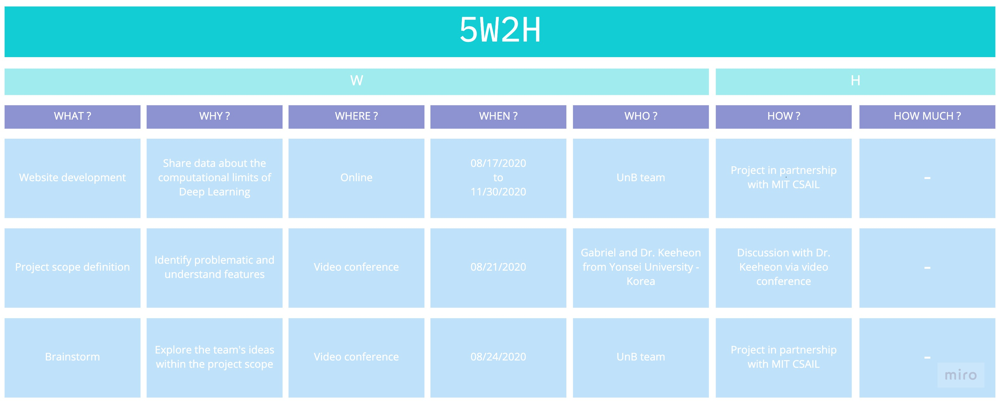

# 5W2H

The 5W2H analysis stands out from other management methodologies as a simple, complete and efficient tool. It allows timely adjustments and modifications, even when action plans are already being put into practice.

This is a type of troubleshooting method that can be used by anyone with a business or personal focus.

Its structure is similar in some respects to the famous “divide and conquer”, since it thoroughly subdivides the planning into several stages, giving it a broader and broader understanding . In other words, it facilitates the systematization and implementation of ideas enormously.

### The 5W
What? — What will be done? — The specification of the action plan. For example: “Prospecting sponsorships for an event”;
Who? — Who’s going to do it? — An action plan with no assigned responsibilities has a few (or zero) chances of being completed. You need to have a person or team assigned to act;
When? — When will it be done? — the date planned for starting and completing the activity, taking into account the risks. O cumprimento do cronograma deve ser uma meta do plano de ação;
Where? — Where will it be made? — can have one or many locations, this will depend on the task. Setting this point in the plan will help you to consider the change and its costs on time and in the budget;
Why? — Why is this going to be done? — Every action must have a reason. A company can’t define a plan without something bigger behind it. For example: “Why do we want to prospect sponsors for the event? Because it must be financially viable. “

### The 2H

How? — How will it be done? — In this item, a more detailed specification of the action plan is included. It can be a breakdown of activities, dates and responsibilities of each. We will continue to use the example of sponsorship prospecting:
Define sponsorship and benefit ranges;
Map the 100 largest customers in the company in the last year;
Pick up 10 customers per day;
Start the trading flow with the best prospects.
How much? — How Much will it cost? — Every action plan must have a budget. It may be general, but ideally it is fragmented in stages; by actions or activities.

---

**Author** : Gabriel Filipe 
**Version:** 1.0 

---
## References
---
- **[Moodle]** Serrano, Milene. Vídeo Aula : 5w2h.
- **[WebSite]** <a href="dt">https://scoreplan.com.br/5w2h-analysis-a-method-of-troubleshooting-and-drawing-action-plans/</a>

***
## Versioning of this page
---

| Date | Author(s) | Description | Version |
|------|-------|-----------|--------|
| 09/07/2020 | Gabriel Filipe | Creates the page and adds 5w2h | 1.0 |
