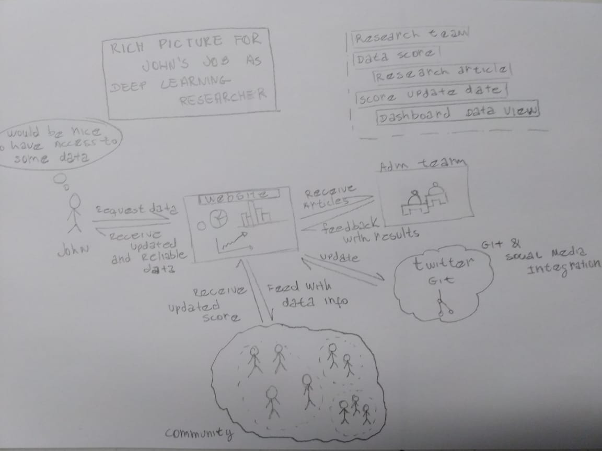
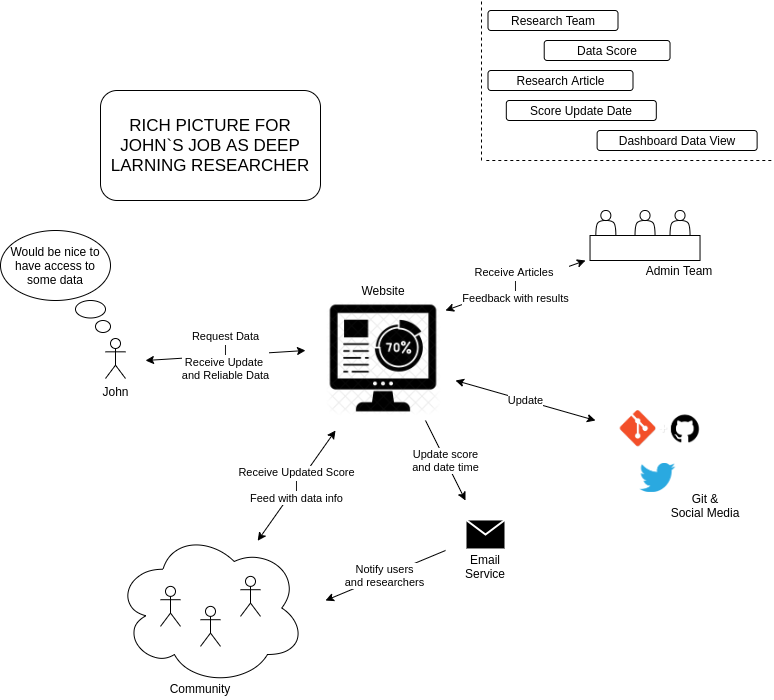
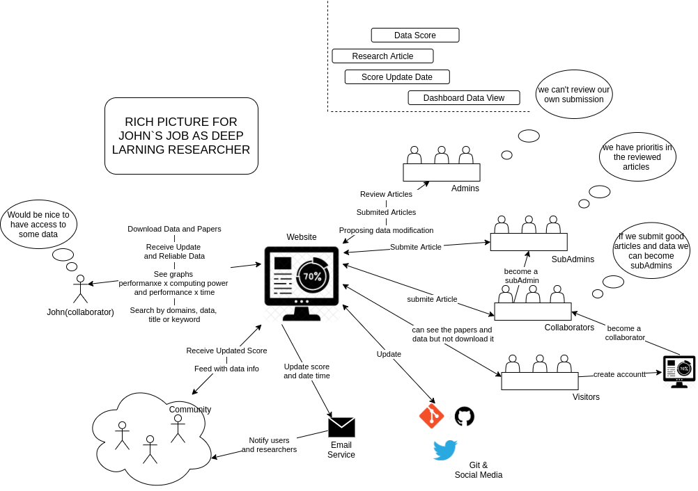

#RichPicture

Rich Picture is an artifact that contains a fast and objective design. The goal is to express a desire for character and activity.

The source of this rich image is a brainstorm with the development team.

## Rich Pictures

#### Handmade Rich Picture

#### Digital Rich Picture

- Version 1
  

- Version2

---
## References
---
- **[Moodle]** Serrano, Milene. Vídeo Aula : RichPicture.

***
## Document Versioning
---

| Date | Author(s) | Description | Version |
|------|-------|-----------|--------|
| 09/02/2020 | Vitor Meireles | Creating the document and adding the handmade Rich Picture | 1.0 |
| 09/03/2020 | Vitor Meireles |  Addition of digital version and some improvements | 1.1 |
| 25/09/2020 | Mikhaelle Bueno |  Update to version 2| 1.2 |
