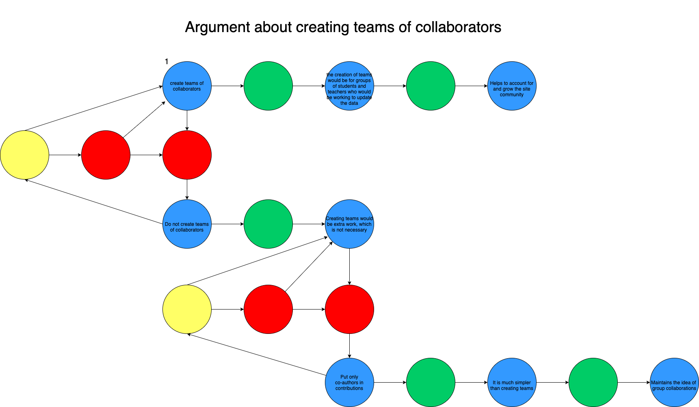
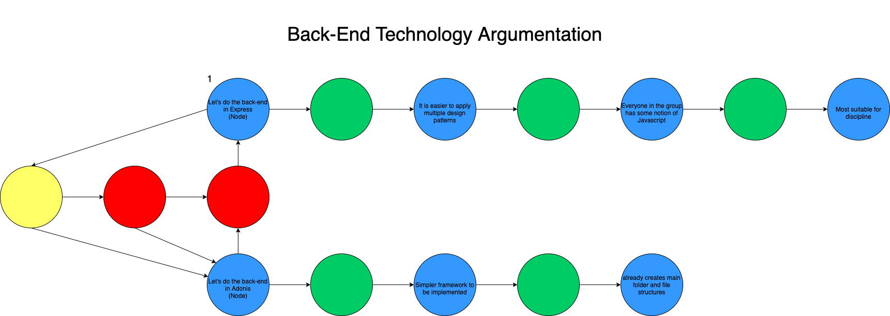

# Argumentation

Argumentation literally means the act or effect of arguing, which in turn means presenting facts, ideas, evidence, logical reasons, etc. that prove a statement. According to **Rahwan** (2005), one of the main objectives of argumentation is to bring the various controversial points of view to a consistent and rational resolution.

**Author** : Guilherme Deusdará 
**Version:** 0.1 

**Author** : Guilherme Deusdará 
**Version:** 0.1 

 

---
## References
---
- JURETA, Ivan; MYLOPOULOS, John; FAULKNER, Stéphane. Analysis of Multi-Party Agreement in Requirements Validation, Proceedings of the 17th IEEE International Requirements Engineering Conference IEEE Computer Society, pp. 57-66, 2009.
- RAHWAN, I. Guest editorial: Argumentation in multi-agent systems. Autonomous Agents and Multi-Agent Systems, Kluwer Academic Publishers, v. 11, n. 2, p. 115–125,2005. ISSN 1387-2532. Disponível em: <a href="dt">http://dx.doi.org/10.1007/s10458-005-3079-0.</a>

***
## Document Versioning
---

| Date | Author(s) | Description | Version |
|------|-------|-----------|--------|
| 09/09/2020 | Guilherme Deusdará | Creates page and adds first version | 0.1 |
