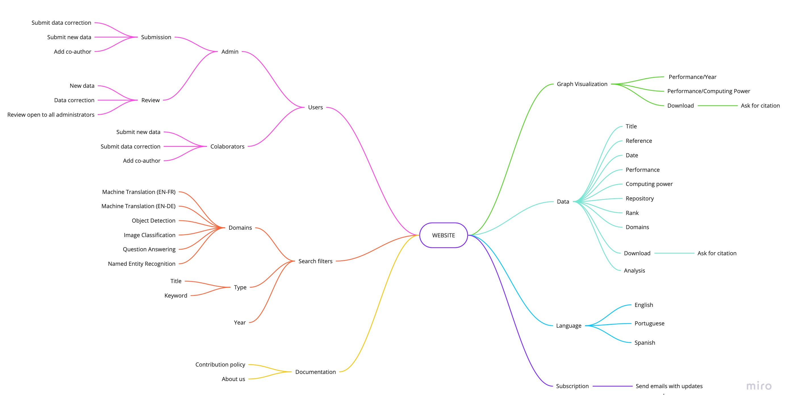
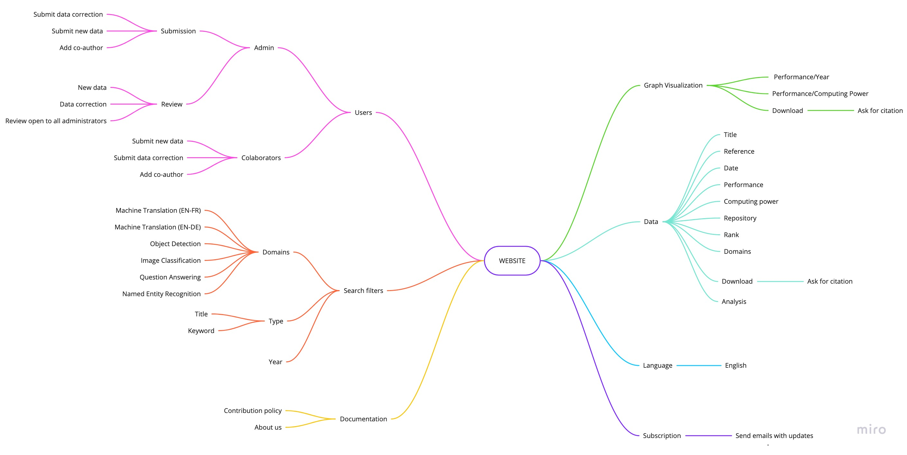
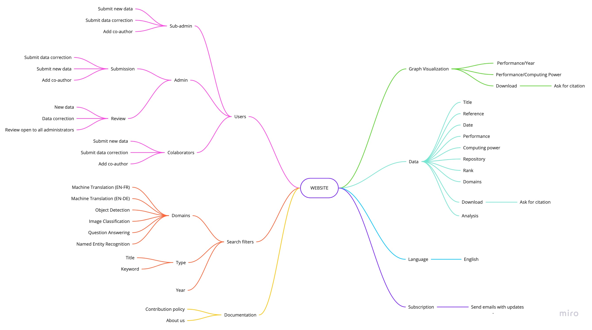

# Mind Map

A mind map is a diagram used to visually organize information. A mind map is hierarchical and shows relationships among pieces of the whole. It is often created around a single concept, drawn as an image in the center of a blank page, to which associated representations of ideas such as images, words and parts of words are added. Major ideas are connected directly to the central concept, and other ideas branch out from those major ideas.

For this project we created a mind map based on the group brainstorm.

**Author** : Gabriel Filipe & Guilherme Deusdará 
**Version:** 0.1  
[Click here](https://ibb.co/MVsWJkN) to have a better visualization.  

**Author** : Gabriel Filipe & Guilherme Deusdará 
**Version:** 1.0 
[Click here](https://ibb.co/qrD4zBh) to have a better visualization.  

**Author** : Gabriel Filipe 
**Version:** 2.0 
[Click here](https://ibb.co/rfYrBHR) to have a better visualization.  

 

---
## References
---
- **[Moodle]** Serrano, Milene. Vídeo Aula : Mapa Mental.
- **[WebSite]** <a href="dt">https://en.wikipedia.org/wiki/Mind_map</a>

***
## Document Versioning
---

| Date | Author(s) | Description | Version |
|------|-------|-----------|--------|
| 09/03/2020 | Gabriel Filipe & Guilherme Deusdará | Creates page and adds first version | 0.1 |
| 09/07/2020 | Gabriel Filipe & Guilherme Deusdará | Updates mind map | 1.0 |
| 09/25/2020 | Gabriel Filipe  | Updates mind map | 2.0 |
