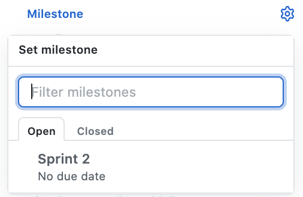

# Contributing

To contribute to this project follow the guide on how to contribute.

1- Create a fork or clone the repository.
````Git
git clone https://github.com/UnBArqDsw/2020.1_G2_TCLDL.git
````
2- If you want to change something, create a branch following the branch policy of this project.

3- Commit you change following the commit policy of this project

4- Create a pull request following the Pull Request policy

## Branches Policy

The <b> Branches </b> of the project must include the following specifications:

* The beginning of the branch name must be informing which group it belongs to, being:
    * feature: For adding features or changes to an existing one; 

    * bug: For bug fixes;


* The name of the branch must be related to the issue number separated by a slash('/')

* Each branch is aimed at solving a single issue, after closing the issue the branch must be deleted

````Git
Exemplo: feature/1
````
### Branch Flow

The project will adopt a git flow based on git-flow:

 * master: Is the main branch of the repository and plays the role of the production environment. It only accepts duly tested and validated code, so that all insertions made therein will be the project releases;

 * develop: is the branch that will concentrate all the new functionalities of the project, where it will perform the role of concentrating the work of the development environment, bug fixing and finalization of tests;

 * feature (feat): type of branch used for the development of a new project feature, so the name of the branch should be "feature/" and the number of the issue in github. Ex: “feature/001”;

 * Bugfix (bug): Branch to fix bugs in production;


## Commits Policy

The <b> Commits </b> of the project must include the following specifications:

* Must be written in English and use the imperative verbs

```` git
Example: update project readme
````

* For joint work, use co-authored to include as a contributor in the commit message body:
```` git
add signin feature

Co-authored-by: Fulano <funalo@outlook.com>
````

## Pull Request Policies

### Creation of _Pull Request_

Consider a hypothetical situation where we are looking to create a PR for a _branch_ called **Sprints** for _master_.

#### Note:

- The creation of the PR must be done right after the beginning of the work on an issue. For that, we work with the _status_ **WIP** flag.

### To create a _pull request_ directed to a _master_ branch, the following steps must be followed:


#### 1) Add the _status_ flag

* Title the PR with the tag **WIP** (ie _work in progress_)

#### 2) Add a description

* Use _issue_ _template_ for _pull request_.
* Remembering that the _pull request_ has the _branch_ base to **_master_** and _compare_ to the branch that you want to join.
* **Remembering**: as soon as the changes regarding the _pull request_ are really finalized, the **WIP** tag must be removed.


 
#### 3) Add the _reviewers_

* Check the _reviewers_, that is, those responsible for the analysis of the _pull request_.


#### 4) Add the _assignees_

* Tick the _pull request_ employees


#### 5) Add the appropriate _labels_

* Check the _labels_ related to the _pull request_. It will generally be the same as indicated in the referring issue.


#### 6) Add the appropriate _milestone_

* Check the _Milestone_, that is, the current _sprint_ or _release_.



#### 7) Explain the _issue_ related to PR

* Connect the _issue_ worked on this _pull request_ through _closing keywords_.


| Issue to be _linked_ | Syntax | Example |
|----------|------|--------------------|
| Issue within this repository | KEYWORD # ISSUE-NUMBER | **Close #10** |

#### 8) Conflicts

* If a pull request causes some kind of conflict, it must be resolved first by the team that developed what is causing the conflict, valuing the integrity and organization of the commits history, and then the request for merge evaluation must be redone.


## Document Versioning

| Date | Author(s) | Description | Version |
|------|-------|-----------|--------|
| 09/06/20 | Mikhaelle Bueno | Document creation and edit | 1.1 |
| 09/10/20 | Gabriel Filipe | Adds PR policy | 1.2 |