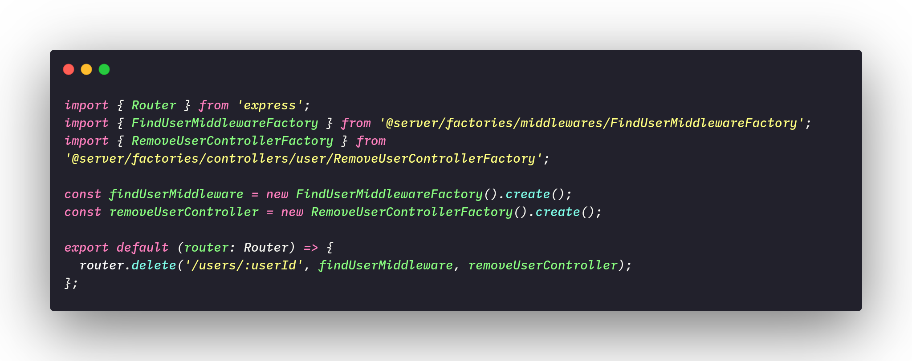

# **<a href="#sp">Behavioral Patterns</a>**

Behavioral patterns are patterns aimed at changing the level of behavior of objects. In this document we will give a brief overview of the existing standards and explain further the patterns we use in our project.

- **Command**: Control calls to a specific component, modeling each request as an object. Allow operations to be undone or recorded.
- **Iterator**: Provide an efficient way to cycle through the elements of a collection sequentially, without exposing the internal structure of the collection.
- **Mediator**: Reduce the number of "connections" between objects by introducing a mediator, who will carry out all communication.
- **Observer**: Define an efficient mechanism to react to changes made to certain objects.
- **State**: Change the behavior of a given object according to the state it is in.
- **Strategy**: Allow, in a simple way, the variation of the algorithms used in the
solving a particular problem.
- **Template Methods**: Define the order in which certain steps must be taken to solve a problem and allow these steps to be carried out in different ways depending on the situation.
- **Visitor**: Allow specific updates to a collection of objects according to the particular type of each updated object.
- **Memento**: It allows to store the internal state of an object at a certain time, so that it is possible to return it to this state, without causing problems with the encapsulation. A class is responsible for saving the state of the desired object; while another class is responsible for storing all these copies.
- **Chain of Responsability**: Avoid dependency between a receiving object and a requesting object. The base maintains a pointer as "next". Each derived class implements its own contribution to handle the request.

## <a href="#adp">Strategy</a>

The strategy is a behavioral design pattern that allows us to define a family of algorithms, make each algorithm become a class and make the objects of those classes interchangeable. This pattern helps us to encapsulate decision-making algorithms at runtime, this means that instead of implementing an algorithm with all pre-defined decision-making, our code can receive instructions at runtime and from choose which strategy he will follow.

File: 

### <a href="#OB">Objectives and problems solved</a>

In our project we use the strategies to solve the problem of user authentication roles and the problem of JWT (Jason Web Token), which are also part of the user authentication flow.

 **Brief explanation of authentication flow**: 

In our project there are four types of users, these users are divided between users who have an account, and users who do not have an account. For users who have an account there are roles that define the permission level of these users, they are:

- Admin: Users with maximum permission level, are responsible for accepting and reviewing papers sent by other users.
- Sub-Admin: They are users who can review the papers but cannot accept them.
- Collaborator: Users who can only submit papers.

For a visualization and better understanding of the user authentication flow, it is recommended to read the following documents: 

[Class Diagram](../traditionalModeling/staticDiagrams/classDiagram.md)

[Sequence Diagram](../traditionalModeling/dynamicDiagrams/sequenceDiagram.md)

Bearing in mind that each user has a role, at request time it is necessary to create a JWT for each user and the JWT will define which tasks that user will be able to perform. Thus, the strategy is the most suitable standard for solving this problem and that is why we chose it for this. 

## <a href="#dec">Chain of Resposability</a>

The chain of responsibilities is a behavioral pattern that allows you to forward requests through a chain of handles. When a handle receives the request, it decides whether it will handle that request or pass it on.

### <a href="#OB">Objectives and problems solved</a>

In our project it is basically a giant chain of responsibility, this happens due to the principle of inversion dependency control which is widely used due to the Hexagonal architecture that is being used in our project, but a more specific example of this chain is the <a href="https://github.com/UnBArqDsw/2020.1_G2_TCLDL_Paper_Service/blob/master/src/server/routes/RemoveUserRoute.ts" target="blank"> RemoveUserRoute.ts </a> file, where we call one method of a class to find the user by the request id, and if that user is found we call another method of another class to have that user removed.

Code Example: 

---
## References
---

- **[Moodle]** Serrano, Milene. Vídeo Aula : Gofs Comportamentais
- **[WebSite]** <a href="deco">https://refactoring.guru/design-patterns/strategy</a>

---

## Document Versioning

| Date | Author(s) | Description | Version |
|------|-------|-----------|--------|
| 10/23/2020 | Lorrany Azevedo | Document creation | 0.1 |
| 10/26/2020 | Lorrany Azevedo| Add document structure | 0.2 |
| 10/26/2020 | Lorrany Azevedo, Ygor Galeno | Add strategy definition | 0.3 |
| 10/26/2020 | Lorrany Azevedo, Gabriel Fillipe | Add behavioral patterns definition | 0.4 |
| 10/26/2020 | Lorrany Azevedo, Mikhaelle Bueno | Add objectivies and problems solved - Strategy | 0.5|
| 10/26/2020 | Lorrany Azevedo, Guilherme Deusdará | Add objectivies and problems solved - Chain of Resposability | 0.5|
