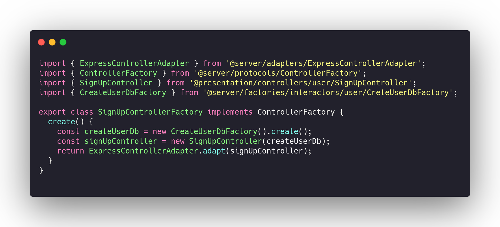
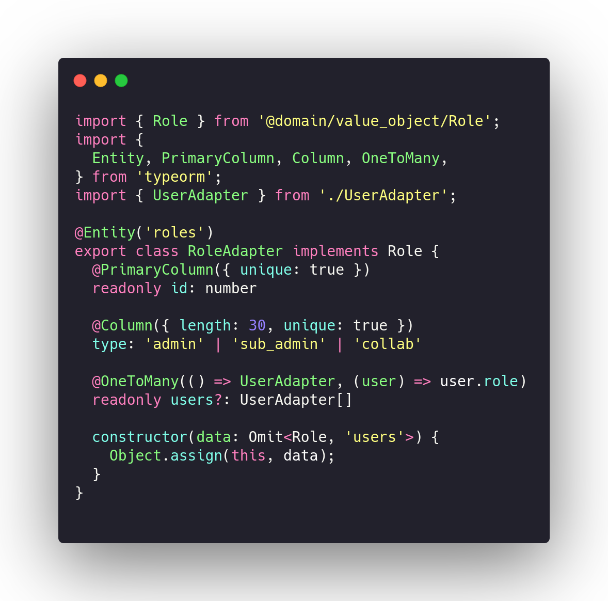

# **<a href="#cr">Creational GOF's</a>**

- **Factory Method**: Delegates instantiation to mirror subclasses. A subclass can be created as a mirror of the upper class. This subclass is specialized in creating instances. 
- **Abstract Factory**: Similar to the Factory Method, but the difference is in the encapsulation of a group that has a common theme among them. 
- **Builder**: The Builder takes complex instances and divides their construction into parts.
- **Prototype**: The client consumes a generalist class that is implemented in specific classes that contain the methods of the upper class.
- **Singleton**: Singleton is a single instance of an object that is declared globally.
- **Multiton**: A Multiton is a implemantation of many singletons.
- **Object Pool**:

## **<a href="#fm">Factory Method</a>**

 Delegates instantiation to mirror subclasses. A subclass can be created as a mirror of the upper class. This subclass is specialized in creating instances. It makes it easier to separate the bottleneck of creating an instance, and it may be possible to create a mirror class with abstract methods and from it create classes with concrete methods that override the abstract method and create the instances. 
 No nosso código esses métodos podem ser encontrados nas [Factorys](https://github.com/UnBArqDsw/2020.1_G2_TCLDL_Paper_Service/tree/master/src/server/factories). 

An example is the [SignUpControllerFactory](https://github.com/UnBArqDsw/2020.1_G2_TCLDL_Paper_Service/blob/master/src/server/factories/controllers/user/SignUpControllerFactory.ts) class whose specific purpose is to instantiate users. This class implements a subscription to the ControllerFactory.

 Code example:

 
 
 

Class Diagram Example: 

## **<a href="#af">Abstract Factory</a>**

Similar to the Factory Method, the Abstract Factory creates generic abstract classes that are then implemented in concrete methods, the difference is in the encapsulation of a group that has a common theme among them, creating individual factories for each item. We chose not to use this method in our project because the factory method met our requirements enough and has already allowed for good packaging and easy maintenance.

## **<a href="#bd">Builder</a>**

The Builder takes complex instances and divides their construction into parts. Unlike the Factory Method, the Builder divides the creation of instances into parts, containing more than one abstract method that are instantiated by concrete classes. The Builder has not yet been used in the project, because the Factory Method met the needs and there is not a case, today, where the Builder would be a better alternative.

## **<a href="#bd">Prototype</a>**

The client consumes a generalist class that is implemented in specific classes that contain the methods of the upper class. It generates many optimizations mainly in games and in our project it is used through a TypeScript tool which is Object.assign (). Object.assign () creates a copy of the data and assigns it to this. In Our Project, this method is used in RoleAdapter and UserAdapter.

 Code example:

 

## **<a href="#bd">Singleton</a>**
Singleton is a single instance of an object that is declared globally. This object cannot be instantiated again or modified by other classes. In our project, we chose not to use this standard because it does not comply with architectural standards.

## **<a href="#bd">Multiton</a>**

## **<a href="#bd">Object Pool</a>**
---
## References
---

- **[WebSite]** <a href="https://www.uml-diagrams.org/package-diagrams-overview.html">UML site</a>

- **[Moodle]** Serrano, Milene. Vídeo Aula : GoFs

---

## Document Versioning

| Date       | Author(s)                        | Description                            | Version |
| ---------- | -------------------------------- | -------------------------------------- | ------- |
| 10/23/2020 | Lorrany Azevedo                  | Document creation                      | 0.1     |
| 10/23/2020 | Mikhaelle Bueno, Lorrany Azevedo | Add factory method concept             | 0.2     |
| 10/26/2020 | Mikhaelle Bueno                  | Add factory method concept and example | 0.3     |
