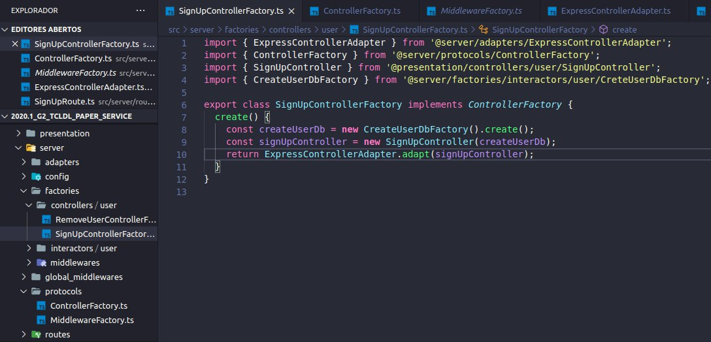
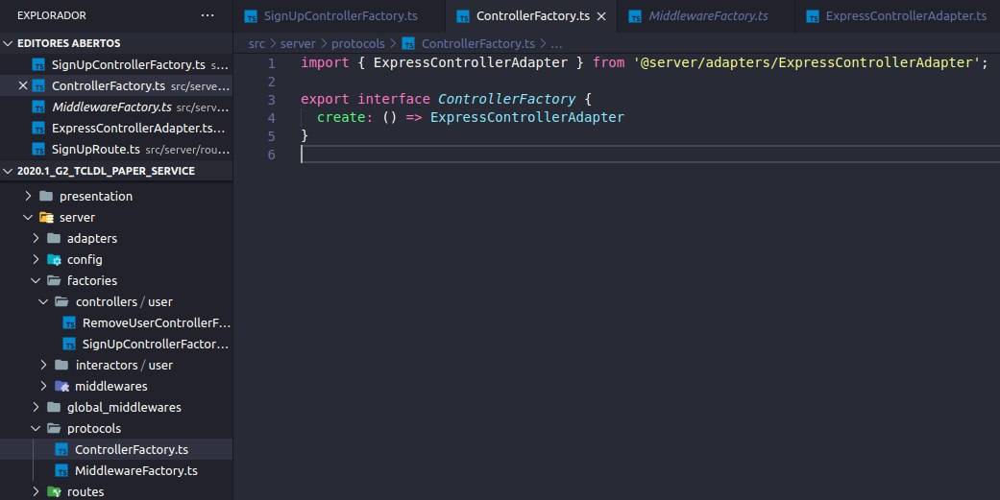
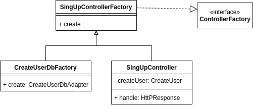

# **<a href="#cr">Creational GOF's</a>**

- **Factory Method**: Delegates instantiation to mirror subclasses. A subclass can be created as a mirror of the upper class. This subclass is specialized in creating instances. 
- **Abstract Factory**:
- **Builder**:
- **Prototype**:
- **Singleton**:
- **Multiton**:
- **Object Pool**:

## **<a href="#fm">Factory Method</a>**

 Delegates instantiation to mirror subclasses. A subclass can be created as a mirror of the upper class. This subclass is specialized in creating instances. It makes it easier to separate the bottleneck of creating an instance, and it may be possible to create a mirror class with abstract methods and from it create classes with concrete methods that override the abstract method and create the instances. 
 No nosso código esses métodos podem ser encontrados nas [Factorys](https://github.com/UnBArqDsw/2020.1_G2_TCLDL_Paper_Service/tree/master/src/server/factories). 

An example is the [SignUpControllerFactory](https://github.com/UnBArqDsw/2020.1_G2_TCLDL_Paper_Service/blob/master/src/server/factories/controllers/user/SignUpControllerFactory.ts) class whose specific purpose is to instantiate users. This class implements a subscription to the ControllerFactory.

 Code example:

 
 
 

Class Diagram Example: 

---
## References
---

- **[WebSite]** <a href="https://www.uml-diagrams.org/package-diagrams-overview.html">UML site</a>

- **[Moodle]** Serrano, Milene. Vídeo Aula : GoFs

---

## Document Versioning

| Date       | Author(s)                        | Description                            | Version |
| ---------- | -------------------------------- | -------------------------------------- | ------- |
| 10/23/2020 | Lorrany Azevedo                  | Document creation                      | 0.1     |
| 10/23/2020 | Mikhaelle Bueno, Lorrany Azevedo | Add factory method concept             | 0.2     |
| 10/26/2020 | Mikhaelle Bueno                  | Add factory method concept and example | 0.3     |
