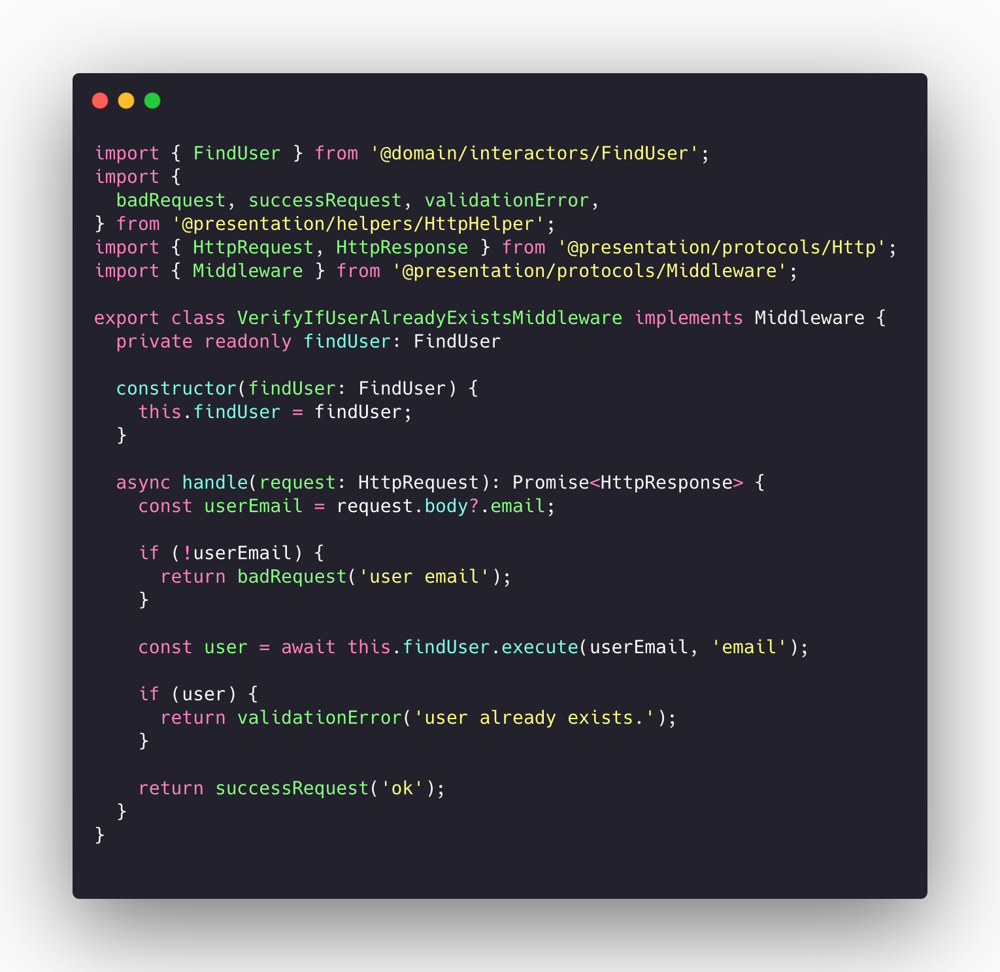
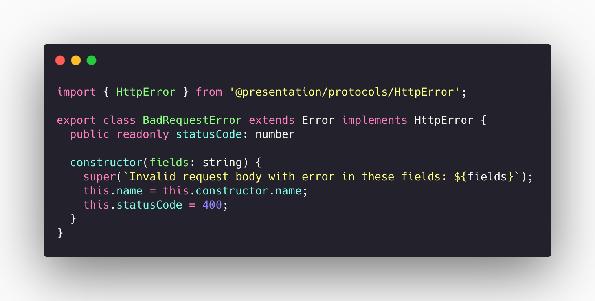
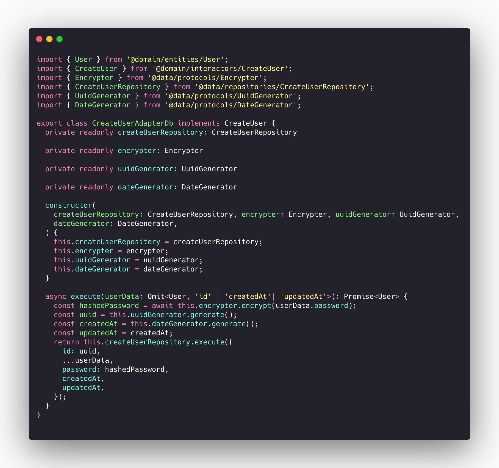
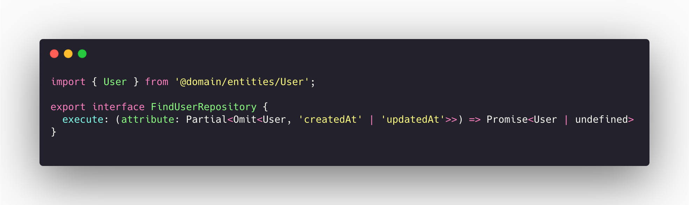
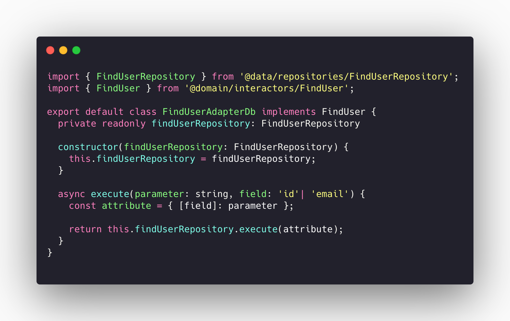
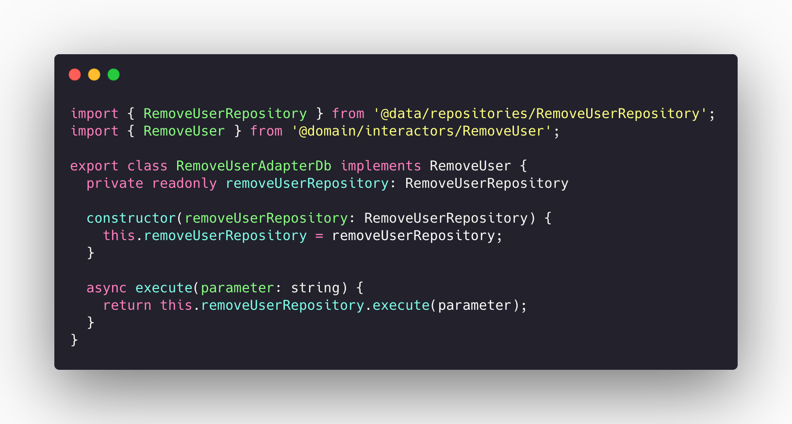
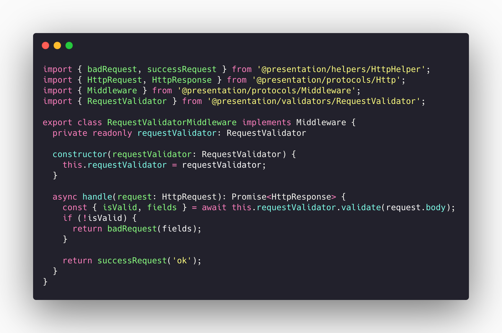

# Emerging Pattern Desing

Emerging design patterns are those associated with the latest platforms and technologies. In our project several of them were implemented and will be discussed in this section.

### List:

#### Back-end

* **S.O.L.I.D**

  - **S** - Single-responsiblity principle;
  - **O** - Open-closed principle;
  - **L** - Liskov substitution principle;
  - **I** - Interface segregation principle;
  - **D** - Dependency Inversion Principle;

* **Dependency injection**

## S.O.L.I.D

> **S.O.L.I.D** is an acronym for the first five object-oriented design (OOD) principles by Robert C. Martin, popularly known as Uncle Bob.

These principles, when combined together, make it easy for a programmer to develop software that are easy to maintain and extend. They also make it easy for developers to avoid code smells, easily refactor code, and are also a part of the agile or adaptive software development.

Let’s look at each principle individually to understand why S.O.L.I.D can help make us better developers.

### Single-Responsibility Principle
S.R.P for short - this principle states that:

> A class should have one and only one reason to change, meaning that a class should have only one job.

arquivo: [VerifyIfUserAlreadyExistsMiddleware.ts](https://github.com/UnBArqDsw/2020.1_G2_TCLDL_Paper_Service/blob/master/src/presentation/middlewares/VerifyIfUserAlreadyExistsMiddleware.ts)

### Open-Closed Principle

> Objects or entities should be open for extension, but closed for modification.

arquivo: [BadRequestError.ts](https://github.com/UnBArqDsw/2020.1_G2_TCLDL_Paper_Service/blob/master/src/presentation/errors/BadRequestError.ts)

### Liskov Substitution Principle

> Let q(x) be a property provable about objects of x of type T. Then q(y) should be provable for objects y of type S where S is a subtype of T.

All this is stating is that every subclass/derived class should be substitutable for their base/parent class.

arquivo: [CreateUserAdapterDb.ts](https://github.com/UnBArqDsw/2020.1_G2_TCLDL_Paper_Service/blob/master/src/data/interactors/user/CreateUserAdapterDb.ts)

### Interface Segregation Principle

> A client should never be forced to implement an interface that it doesn’t use or clients shouldn’t be forced to depend on methods they do not use.

This pattern is implemented in all our back-end structure, and there is a lot of examples.

arquivo: [FindUserRepository.ts](https://github.com/UnBArqDsw/2020.1_G2_TCLDL_Paper_Service/blob/master/src/data/repositories/user/FindUserRepository.ts)

This is an exemple of a simple interface that is extended by the class

arquivo: [FindUserAdapterDb.ts](https://github.com/UnBArqDsw/2020.1_G2_TCLDL_Paper_Service/blob/master/src/data/interactors/user/FindUserAdapterDb.ts)

### Dependency Inversion Principle

The last, but definitely not the least states that:

> Entities must depend on abstractions not on concretions. It states that the high level module must not depend on the low level module, but they should depend on abstractions.

arquivo: [RequestValidatorMiddleware.ts](https://github.com/UnBArqDsw/2020.1_G2_TCLDL_Paper_Service/blob/master/src/data/interactors/user/RemoveUserAdapterDb.ts)

## Dependency Injection

> Design pattern used to implement IoC. It allows the creation of dependent objects outside of a class and provides those objects to a class through different ways. Using DI, we move the creation and binding of the dependent objects outside of the class that depends on them.

The Dependency Injection can be found in our project in all the iteractors. One example can be seen below:

arquivo: [RequestValidatorMiddleware.ts](https://github.com/UnBArqDsw/2020.1_G2_TCLDL_Paper_Service/blob/master/src/presentation/middlewares/RequestValidatorMiddleware.ts)

---
## References
---

- **[WebSite]** <a href="https://www.digitalocean.com/community/conceptual_articles/s-o-l-i-d-the-first-five-principles-of-object-oriented-design">S.O.L.I.D: The First 5 Principles of Object Oriented Design</a>

- **[WebSite]** <a href="https://www.tutorialsteacher.com/ioc/dependency-injection#:~:text=Dependency%20Injection%20(DI)%20is%20a,class%20that%20depends%20on%20them.">Dependency Injection</a>

---

## Document Versioning

| Date | Author(s) | Description | Version |
|------|-------|-----------|--------|
| 10/26/2020 | Gabriel Filipe, Guilherme Deusdará | Document creation | 0.1 |
| 10/26/2020 | Gabriel Filipe, Guilherme Deusdará | Intro | 0.2 |
| 10/26/2020 | Gabriel Filipe, Guilherme Deusdará | S.O.L.I.D | 0.3 |
| 10/26/2020 | Gabriel Filipe, Guilherme Deusdará | Single-responsibility Principle | 0.4 |
| 10/26/2020 | Gabriel Filipe, Guilherme Deusdará | Open-closed Principle | 0.5 |
| 10/26/2020 | Gabriel Filipe, Guilherme Deusdará | Liskov substitution principle | 0.6 |
| 10/26/2020 | Gabriel Filipe, Guilherme Deusdará | Interface segregation principle | 0.7 |
| 10/26/2020 | Gabriel Filipe, Guilherme Deusdará | Dependency Inversion principle | 0.8 |
| 10/26/2020 | Gabriel Filipe, Guilherme Deusdará | Dependency injection | 0.9 |
| 10/26/2020 | Gabriel Filipe, Guilherme Deusdará | References | 1.0 |
