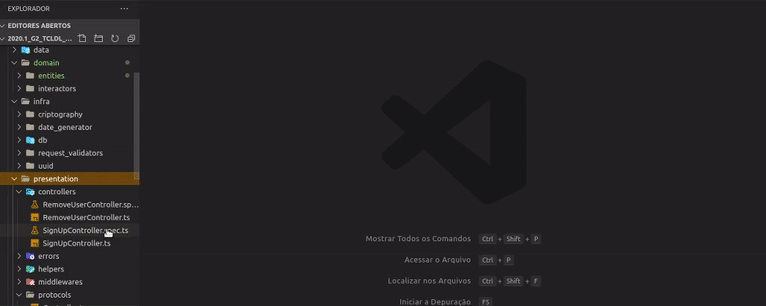
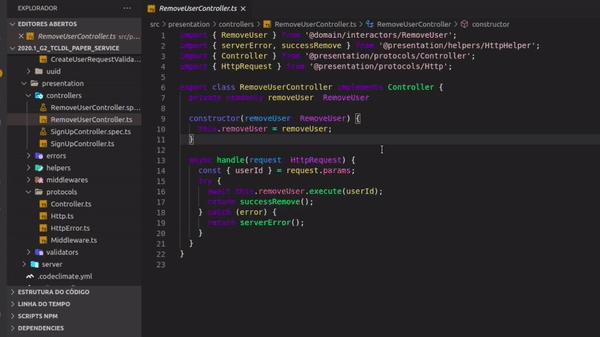
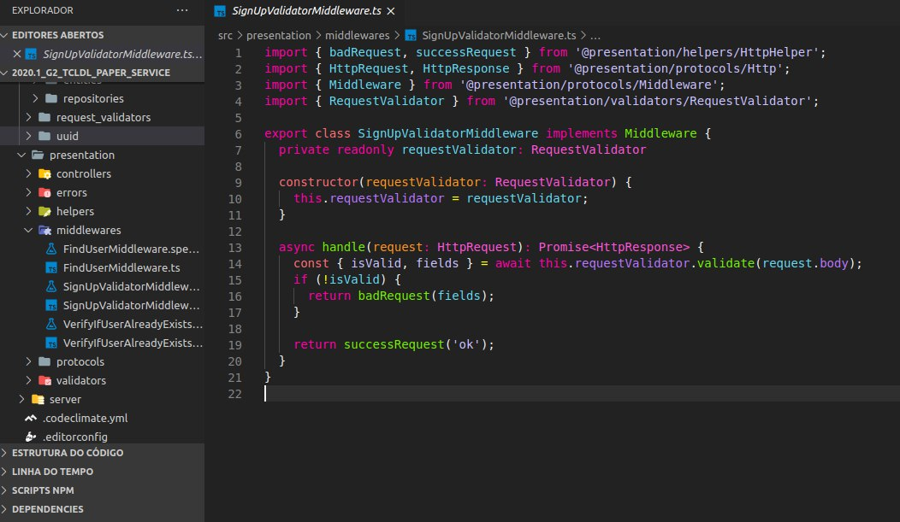

# **<a href="#grasp">General Responsibility Assignment Software Patterns</a>**

GRASP standards are guidelines that assign responsibility to classes and objects in object-oriented designs. The following standards are part of GRASP:

- **Creators**: Class responsible for instantiating objects.
- **Information Expert**: Assigns responsibilities to specialist classes. 
- **Low Coupling**: Coupling is a measure of how strong two elements are connected, that is, how dependent they are on each other. Therefore, the more independent the elements are, the better, as this makes the code more maintainable and reusable.
- **High coeshion**: Elements that are created with a well-defined purpose and are limited to implementing only what they actually need to do. They are objects with highly related and highly focused responsibilities, having a high cohesion is almost synonymous with a code with low coupling.
- **Polymorphism**: Also known as superscript, it is a concept where child classes override superclass methods, they are methods that will contain the same signature but will have different implementations.
- **Protected Variations**: It protects elements from variations of other objects. For this, polymorphism and the use of interfaces are used to help maintain the stability of the element.
- **Pure Fabrication**: Classes created from a project need.
- **Controllers**: Assigns responsibility for handling system events for classes other than UI, it delegates the work that needs to be done to other objects.
- **Indirection**: Mediating object between two elements, this makes the coupling smaller. 

In our project we used several of the patterns mentioned above, below explain why we use these patterns and show where they were used in our project code. 

## **<a href="#Creator">Creators</a>**

As has already been said, creators are the classes responsible for instantiating objects, instantiating objects can be a complicated task and creators are used when some factors occur, one of these factors is when aggregation between two classes occurs.

In our project a example of creators are the interactors. The controllers can be found in: [2020.1_G2_TCLDL_Paper_Service/src/domain/interactors/](https://github.com/UnBArqDsw/2020.1_G2_TCLDL_Paper_Service/tree/master/src/domain/interactors)

A code example is [Createuser](https://github.com/UnBArqDsw/2020.1_G2_TCLDL_Paper_Service/blob/master/src/presentation/controllers/SignUpController.ts) that instantiates a user.

## **<a href="#sp">Information Expert</a>**

Experts are responsible for delegating responsibilities to classes, such as methods, instilling objects, etc. In other words, creators are specialists in instantiating objects. In our code the specialties are.

The above example can also be considered a Information Expert pattern.

## **<a href="#lc">Low Coupling</a>**

As it has also been explained, the concept of low coupling is a very important concept when it comes to maintaining the quality of the software, it allows us greater manageability since the classes seek to be as independent as possible. Grasp patterns alone, when properly used, already reduce our coupling, but we can further decrease this coupling using the gof patterns that will be explained in the documents below.

The hexagonal architecture of our application also allows for low coupling

## **<a href="#hc">High Coeshion</a>**

The concept of high cohesion is directly related to the concept of low coupling, this means that we can only have one if we have the other, to maintain high cohesion it is important to choose an appropriate architecture for your product and to make use of the good software practices, in addition to using the gof and grasp standards we also chose to use a hexagonal architecture, this architecture alone already helps us to maintain a high cohesion since the outer layers cannot access the inner layers, architecture the use of interfaces, factory, adapters and other standards becomes highly necessary so that the layers can communicate with each other in a correct way and respecting the architecture.

## **<a href="#pl">Polymorphism</a>**

The concept of polymorphism is already a well-known concept and used in the object-oriented paradigm, also known as overwriting. It helps us to reuse the code since the child classes can implement the inherited methods in the most appropriate way for the use of that class. In our code we have several cases of polymorphism but we will put just one example of implementation below.

Put photo code example

## **<a href="#cont">Controller</a>**

The controller is the layer responsible for receiving the inputs that users make through the user interface and handling to these events, it is usually the intermediary layer between the requests of the actors and the backend that responds to the requests of those requests. This layer is responsible for understanding the users' requests and immediately afterwards it redirects that request to the element in the backend responsible for handling it. In our code we use the controller pattern a lot and below we have an example of its implementation.

In our project the controllers can be found in: [2020.1_G2_TCLDL_Paper_Service/src/presentation/controllers/](https://github.com/UnBArqDsw/2020.1_G2_TCLDL_Paper_Service/tree/master/src/presentation/controllers). The controllers handle with HTTP requests.

A code example is [SignUpController](https://github.com/UnBArqDsw/2020.1_G2_TCLDL_Paper_Service/blob/master/src/presentation/controllers/SignUpController.ts) 

## **<a href="#ind">Indirection</a>**

The indirect pattern assigns responsibilities to intermediary objects between two other objects, a controller can be considered an object of induction since in an MVC model it is a mediator between as models and as views. Another object that fits this standard is the middleware and validators that are responsible for verifying that the data of a request matches what is expected. In the project code we use middleware, validators and controllers.

In our project the middlewares can be found in: [2020.1_G2_TCLDL_Paper_Service/src/presentation/middlewares/](https://github.com/UnBArqDsw/2020.1_G2_TCLDL_Paper_Service/tree/master/src/presentation/middlewares). The controllers handle with HTTP requests.

A code example is [SignUpValidatorMiddleware](https://github.com/UnBArqDsw/2020.1_G2_TCLDL_Paper_Service/blob/master/src/presentation/middlewares/SignUpValidatorMiddleware.ts) 

## **<a href="#pf">Pure Fabrication</a>**

The concept of pure manufacturing is based on the idea of creating elements that are not necessarily design patterns, but there is a need to create them in order to further improve the quality of the code, they are usually classes created to be intermediate in the communication between other classes, api's that facilitate and improve product quality etc. The concept of indirectness fits here, since this pattern is usually an intermediary between objects. Our main pure manufacturing is the API_Gateway repository, which will be responsible for being the intermediate gate between the client (Frontend) and our server (Backend - Paper_service). 

Link para o API_Gateway

---
## References
---

- **[WebSite]** <a href="https://www.uml-diagrams.org/package-diagrams-overview.html">UML site</a>

- **[Moodle]** Serrano, Milene. Vídeo Aula : GRASP

---

## Document Versioning

| Date       | Author(s)                                            | Description                                                   | Version |
| ---------- | ---------------------------------------------------- | ------------------------------------------------------------- | ------- |
| 10/23/2020 | Lorrany Azevedo                                      | Document creation                                             | 0.1     |
| 10/23/2020 | Lorrany Azevedo, Gabriel Filipe                      | Add grasp concept                                             | 0.2     |
| 10/23/2020 | Lorrany Azevedo, Ygor Galeno                         | Add creators, information expert and low coupling definitions | 0.3     |
| 10/23/2020 | Lorrany Azevedo, Mikhaelle Bueno                     | Add high coeshion definition                                  | 0.4     |
| 10/23/2020 | Lorrany Azevedo, Vitor Meireles                      | Add polymorphis definition                                    | 0.5     |
| 10/23/2020 | Lorrany Azevedo, Mikhaelle bueno, Gabriel Filipe     | Add controller definition                                     | 0.6     |
| 10/23/2020 | Lorrany Azevedo, Mikhaelle bueno, Guilherme Deusdará | Add indirection definition                                    | 0.7     |
| 10/23/2020 | Lorrany Azevedo, Mikhaelle bueno, Ygor Galeno        | Add pure fabrication definition                               | 0.8     |