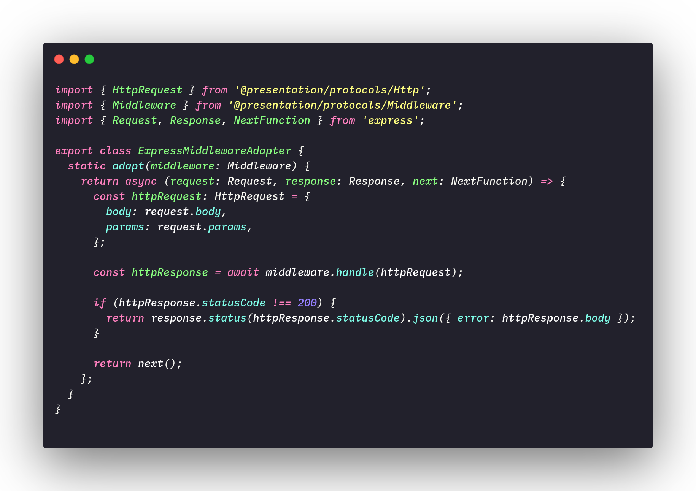

# **<a href="#sp">Structural Patterns</a>**

The structural gofs patterns are concerned with how objects will be organized to form larger structures, these patterns aim to decrease the coupling between these objects. Below we put a small definition of the existing standards and we will explain better those used in the project.

- **Adapter**: Allow an object to be replaced by another that despite performing the same task has a different interface
- **Bridge**:  Separate one abstraction of your representation, so that both may vary and produce types of different objects.
- **Composite**: Group objects that are part of a part-whole relationship in order to treat them without distinction. polimorfismo todo-parte
- **Decorator**: Add functionality a an object dynamically
- **Facade**: Provide a simplified interface capable of centralizing the use of several interfaces of a system.
- **Flyweight**: Efficiently share objects that are used in large quantities.
- **Proxy**: Control calls to an object through another object on the same interface.

## <a href="#adp">Adapter</a>

The adapter design pattern as the definition already tells us, allows us to replace one object with another without complications with our client, it is characteristic of objects with similar behaviors due to the fact that we use polymorphism to overwrite the behavior of these objects. A great use of the adapter is to allow us to change the behavior of a given object without touching its code, avoiding, for example, a new version of it. 

Below we have an example of implementing an adapter:

File: <a href="https://github.com/UnBArqDsw/2020.1_G2_TCLDL_Paper_Service/blob/master/src/server/adapters/ExpressControllerAdapter.ts" target="blank">ExpressControlerAdapter.ts</a>

Another example of an adapter: 

File: <a href="https://github.com/UnBArqDsw/2020.1_G2_TCLDL_Paper_Service/blob/master/src/server/adapters/ExpressMiddlewareAdapter.ts" target="blank">ExpressMiddlewareAdapter.ts</a>

### <a href="#OB">Objectives and problems solved</a>

The adapter in the context of the Paper Service, which is our micro-service responsible for the backend, is used to adapt the Controller interface, which is responsible for receiving customer requests. 

## <a href="#dec">Decorator</a>

The decorator is a design pattern that allows you to add conformity to objects. We started from a base application and added other features to that base.

For a better understanding of the functioning of this pattern, we put below an example that shows us a class diagram of a notification functionality and its respective decorators, the application base sends as notifications only by email, as other forms of notification such as for example SMS are made through decorators.

 (<a href="https://refactoring.guru/design-patterns/decorator" target="blank">Image Reference</a>)

In our application the use of decorators was through TypeORM, which is an ORM (Object-relational mapping) for the language used in the project (TypeScript / JavaScript).

"Object-relational mapping (ORM, O/RM, and O/R mapping tool) in computer science is a programming technique for converting data between incompatible type systems using object-oriented programming languages." (<a href="https://en.wikipedia.org/wiki/Object%E2%80%93relational_mapping" target="blank">Wikipedia</a>)

---
## References
---

- **[Moodle]** Serrano, Milene. Vídeo Aula : Gofs Estruturais
- **[WebSite]** <a href="deco">https://refactoring.guru/design-patterns/decorator</a>

---

## Document Versioning

| Date | Author(s) | Description | Version |
|------|-------|-----------|--------|
| 10/23/2020 | Lorrany Azevedo | Document creation | 0.1 |
| 10/25/2020 | Lorrany Azevedo, Ygor Galeno | Add gofs description | 0.2 |
| 10/25/2020 | Lorrany Azevedo, Gabriel Fillipe | Add adapter concept | 0.3 |
| 10/26/2020 | Lorrany Azevedo, Mikhaelle Bueno| Add adapter code example | 0.4 |
| 10/26/2020 | Lorrany Azevedo, Guilherme Deusdará| Add adapter code example | 0.5 |
| 10/26/2020 | Lorrany Azevedo, Gabriel Fillipe, Mikhaelle Bueno| Add decorator definition | 0.6 |