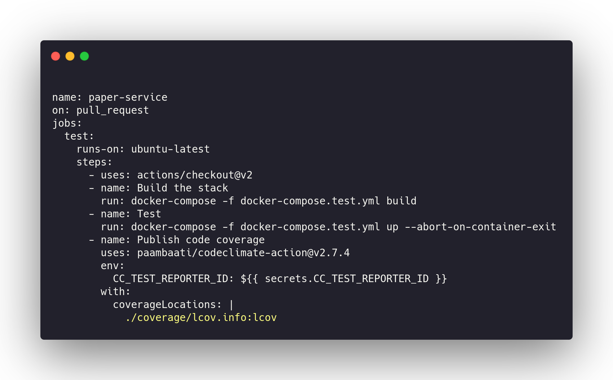
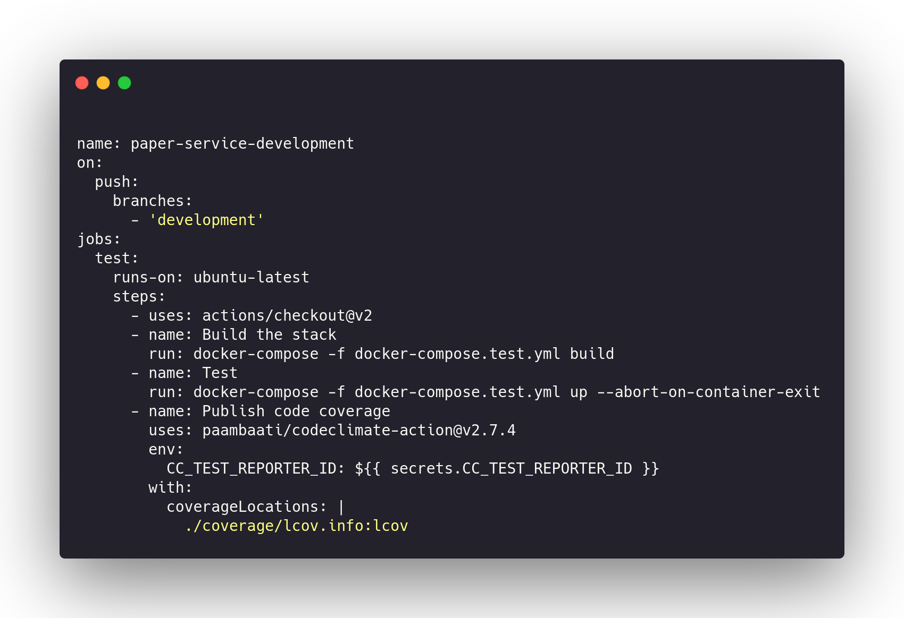
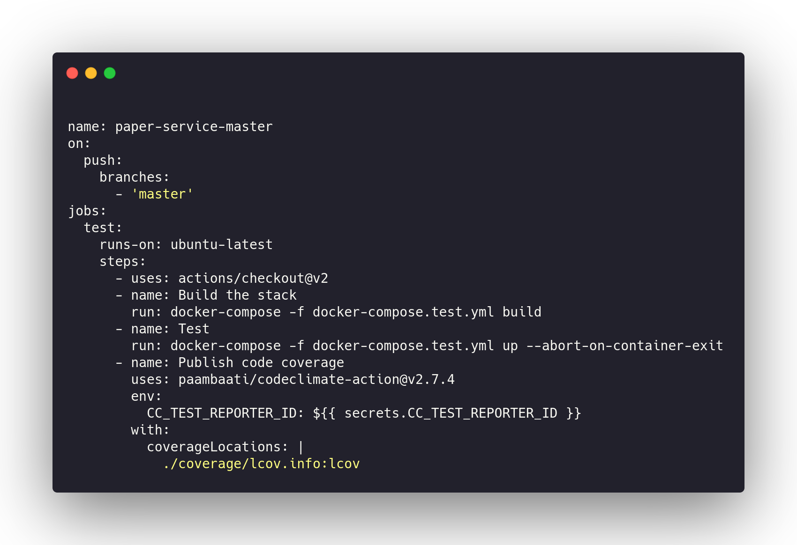

### GitHub Actions

GitHub Actions is part of our CI/CD and each service code is being shown under.

This is paper-service code

This is the development part of paper service

This is the paper service to master integration

## Document Versioning

| Date | Author(s) | Description | Version |
|------|-------|-----------|--------|
| 10/25/2020 | Vitor Meireles | Document creation | 0.1 |
| 10/26/2020 | Vitor Meireles | Add contents  | 1.0 |