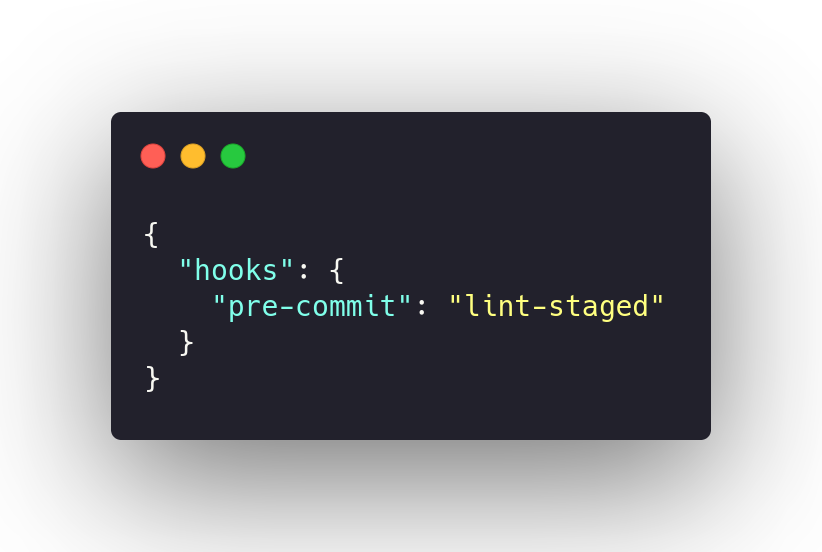

### Husky

Husky is a hook for lint and your simple code is put following.

## Document Versioning

| Date | Author(s) | Description | Version |
|------|-------|-----------|--------|
| 10/25/2020 | Vitor Meireles | Document creation | 0.1 |
| 10/26/2020 | Vitor Meireles | Add contents  | 1.0 |
