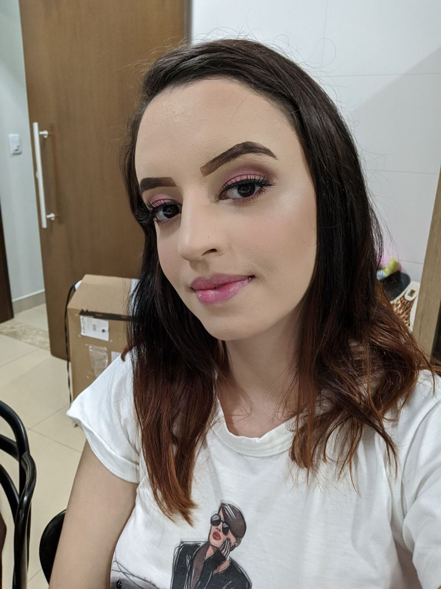

# About

You want to understand the beahavior of Deep Learning models in terms of scalabily or other Deep Learning issues? Or share your paper? The TCLDL can help you. 

TLCL is a web site for update papers related to deep leraning, share it, and show it in some graphics.

# Who we are

<a href="https://github.com/lorryaze">
  

    
  

</a>
<a href="https://github.com/gabrielfilipe7unb">
  

    
  

</a>
<a href="https://github.com/Mikhaelle">
  

    
  

</a>
<a href="https://github.com/VitorMeirelesOliveira">
  

    
  

</a>
<a href="https://github.com/gdeusdara">
  

    
  

</a>
<a href="https://github.com/ygortgaleno">
  

    
  

</a>

## Document Versioning

| Date | Author(s) | Description | Version |
|------|-------|-----------|--------|
| 09/01/20| Lorrany Azevedo | Document creation | 0.1 |
| 09/01/20| Lorrany Azevedo | Document edit | 0.1 |

