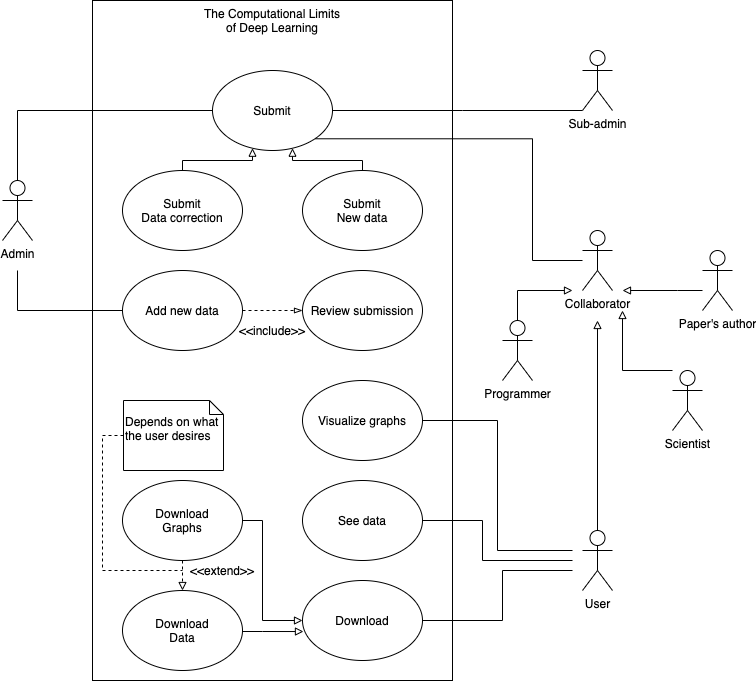

# Software Architecture Document

This document aims to register the architectural structure of the TCLDL website, developed as a final product of the ADS (Architecture and Software Design) discipline, on the Gama campus, at the University of Brasília.
 
The Software Architecture Document demonstrates the set of views that intend to cover the technical and structural aspects related to the development and implementation of the TCLDL website.

## 1. Introduction
This architecture document has the function of specifying and documenting relevant architectural decisions in the production and implementation of the TCLDL website describing aspects of the system in a clear, structured and objective manner.

### 1.1	Purpose

This document applies to the development process of the TLDL website, an application developed in the discipline Architecture and Software Design, at the University of Brasília, in order to provide articles and data to be obtained quickly and easily.
 

### 1.2	Scope

In this project, using the RUP (Rational Unified Process), we start with a typical set of views called "4 + 1 view model".
The different views are listed below and will be addressed in the scope of this document.
 
- Use-Case View
- Logical View
- Implementation View
- Process View
- Deployment Vision
- Data View
- Implantation View

### 1.3	Definitions, Acronyms, and Abbreviations
- RUP (Rational Unified Process)
### 1.4 References	
https://nextjs.org/

https://www.postgresql.org/

https://expressjs.com/

### 1.5	Overview

For the FrontEnd a component architeture is used with NextJs and in the BackEnd hexagonal architeture is used with Express. More about this is described in the next sections

## 2. Architectural Representation

Model of representation of the implemented services and the interactions established between those services, as well as the nature of these interactions.

### 2.1 Tecnologies
#### 2.1.1 Front-End 

 
The **NextJs** is a react framework that use javascript language and is component oriented. It has some feature like: hybrid static & server rendering, typeScript support, smart bundling, route pre-fetching, and more.
   
**NextJs** was chosen to be used in the scope of the discipline because almost all members of the team had already had contact with React and the JavaScript language which would facilitate the site development process. In addition, the framework offers easy installation, quick configuration, easy learning, fast performance and several features that facilitate the development process, such as automatic route mapping.
#### 2.1.2 Back-End
**Express** Express is a framework for web applications in Node.js, which uses javascript and has support for typescript. Small and flexible, it contains a robust set of features for web and mobile applications.
 
Express was used to build the back end of the web application and was chosen because it is not a framework with a cast architecture, and can be shaped according to the needs of the discipline. In addition, it demonstrates all its value in its choice when it comes to real-time services, and also, for its wide community that actively maintain the framework, in addition to its simplicity.

#### 2.1.3 Data Base
**PostgreSQL** is a powerful, open source object-relational database system with over 30 years of active development that has earned it a strong reputation for reliability, feature robustness, and performance.

The use of PostgreSQL was based on its robustness, as it is one of the most used banks in the world, and one of the most common in cloud services.

###  2.2 Architectural Goals and Constraints
**Goals**

|Requirements | |
|------|------|
|Scalability | The application must be scalable |
| Security | The application must safely handle users' sensitive data |
| Continous Integration | The application must have continous integration|

**Constrains**

|Constrains | |
|------|------|
| Connectivity | Internet connection is required|
| Language | The application will be developed in English|
| Team | The team has 6 people|
| Deadline | The proposed scope must be completed by the end of the course|

## 3. Use-Case View
The Use-Case Diagram describes the main features that the system intends to have. It is built of actors, who represent the real users of the system and the functionality (present in balloons) of the proposed application.
 
Use-case diagrams are used to describe the Use-Case View because it offers a high-level model in relation to functionality
 
During the development of the project, versions of the diagram have already been created, which can be seen in the [Use-Case Diagram](../traditionalModeling/dynamicDiagrams/userCase.md).
 
However, the most current version can be seen below:

.

## 4. Logical View

The logical view is basically a view of the project model, visualized through packages, classes and interaction diagrams.
 
The Package Diagram are normally used in this view. It is defined by the UML and describes the packages or pieces of the system divided into logical groupings showing the dependencies between them. This diagram is widely used to illustrate the architecture of a system showing the grouping of its classes.

The most updated version of it can be seen below, and its traceability can be followed in the [Package Diagram](../traditionalModeling/staticDiagrams/packageDiagram.md).

### 4.1 Front-end Logical View
.
Author: **Mikhaelle Bueno**

### 4.2 Back-end Logical View
.
Author: **Mikhaelle Bueno**

## 5. Process View

Give details how operations are carried out, what messages are sent and when. Capture the process view of an architecture and provide a
dynamic view of behavior.

### 5.1 Visitor - Process View

.
Author: **Gabriel Filipe**

.
Author: **Guilherme Deusdara**

### 5.2 Collaborator - Process View

.
Author: **Guilherme Deusdara**

### 5.3 Admin - Process View

.
Author: **Gabriel Filipe**

## 6. Implementation View

### 6.1	Overview
### 6.2	Layers

## 7. Data View (optional)

## 8. Size and Performance

## 9. Implantation View

The implantation diagram is a structural UML diagram that seeks to describe the application system, it represents the physical distribution of the system through hardware nodes, components and dependencies.

In our project we use Docker to create application containers and run them individually, so the containers are our representation of us. We also use Docker-Compose to integrate application containers and upload them all at once. Below is a diagram of the TCLDL implementation.

.

Currently, due to the great demand for work, we were unable to implement the gateway, so the client's requests are hitting the paper service, but it is an important part of the application and will be implemented in the future.

Author: **Lorrany Azevedo**

## 10. Architectural Pattern

  Hexagonal/DDS

## 11. Quality

Ensuring quality, the chosen architecture model (Hexagonal) helps us to maintain the scalable application, as this architecture is designed precisely so that large applications remain cohesive with the creation of service layers according to their responsibilities. Therefore, each layer / service is implemented independently, which in line with design standards and good programming practices helps us to keep very large software healthy.

The choice of this architecture was due to the fact that the group has a plan to make the project expand after the end of the story and we believe that it has a great potential to grow and become a robust and complex project.

In addition we also have some artifacts that were produced and that are highly related to the quality of a software, considering that in order to build quality software it is necessary to take into account not only the functional requirements specified by the customer, but also non-functional requirements.

### 12.1 NFR

Nfr is intended to track non-functional requirements, our first version of nfr was made on the first delivery, this version is available at the link below:

[First NFR](../base/requirements/modeling/NFR-framework.md).

Bellow we have a new version of NFR. 

[New NFR](./images/NFR.png). 

Author: **Lorrany Azevedo**

---
## References
---

- **[Moodle]** Serrano, Milene. Vídeo Aula : DAS
- **[WebSite]** <a href="http://www.deinf.ufma.br/~geraldo/dob/13.Componentes_Implantacao.pdf">Componentes_Implantação</a>

---
| Date | Author(s) | Descrição | Versão |
|------|-------|-----------|--------|
| 11/18/2020 | Mikhaelle Bueno | Creating the document | 0.1 |
| 11/19/2020 | Mikhaelle Bueno | Adding introdution | 0.2 |
| 11/20/2020 | Lorrany Azevedo | Adding quality and nfr documents | 0.3 |
| 11/20/2020 | Lorrany Azevedo | Adding implantation description and diagram | 0.4 |
| 11/20/2020 | Guilherme Deusdara | Adding visitor's procces diagram | 0.5 |
| 11/20/2020 | Gabriel Filipe | Adding visitor's procces diagram v1 | 0.6 |
| 11/20/2020 | Guilherme Deusdara | Adding collaborator's procces diagram | 0.7 |
| 11/20/2020 | Gabriel Filipe | Adding admin's procces diagram | 0.8 |
