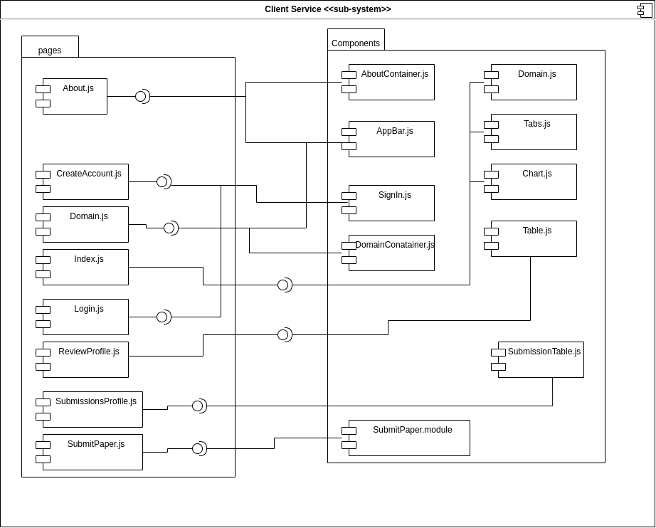

# Software Reuse Document

Software reuse is very necessary when it comes to software quality. Having maintainable, cohesive and loosely coupled software helps us to improve the quality of the software and saves us from various problems that can occur during development, in addition, a well-planned software saves costs, both in labor and consumption of hardware.

So currently there are several concepts and standards that help us to implement good software and make it more maintainable. In addition to the forms of reuse already mentioned in the [Desing Patterns](../desing_patterns/grasp.md) documents below we will talk about some of them and will discuss in more detail those that were used in our project.

# Framework and Libraries

The concept of framework, it provides a set of solutions for similar problems of different applications. These generic solutions can be switched according to the wishes and needs of users and applications. Frameworks can be developed by the developers of an application to meet the need to solve a set of problems that appear in several specific features of that application, or it can also be a more general tool that solves more generic problems in the area of ​​software development, such as example the React framework, which is a framework written in javascript and generates html, this framework is widely used and allows us to create web pages with complex design without the need for lines and more lines of html.

In our project we did not create any specific framework or library for TCLDL, but we used frameworks both on the frontend and on the backend of our application. These frameworks are described in more detail in the DAS document.

- [Frontend framework - Next.Js](./das.md).
- [Backend framework - Express](./das.md).

# Components

Reuse through components is widely used and in our code it was used both on the backend and on the frontend. Some component diagrams have already been made and covered in the delivery of [Traditional Modeling - Component Diagrams](../traditionalModeling/staticDiagrams/componentDiagram.md), clicking on the link below you can see all previous versions of these diagrams.

- [Frontend Componets Diagram](../traditionalModeling/staticDiagrams/images/component_diagram02.png)
- [Backend Componets Diagram](../traditionalModeling/staticDiagrams/images/back_component_diagram2.png)

In addition, some new components were created to meet some needs of the frontend and reuse code, since these components are common to several pages of the site, below we have a diagram for the new components.

---
## References
---

- **[Moodle]** Serrano, Milene. Vídeo Aula : Reutilização e framework
- **[Wikipedia]** <a href="https://en.wikipedia.org/wiki/Software_framework">Software Framework</a>

| Date | Author(s) | Descrição | Versão |
|------|-------|-----------|--------|
| 11/20/2020 | Lorrany Azevedo | Creating the document | 0.1 |
| 11/20/2020 | Lorrany Azevedo | Adding introdution | 0.2 |
| 11/20/2020 | Lorrany Azevedo | Adding framework and library concepts | 0.3 |
| 11/20/2020 | Lorrany Azevedo | Componets concepts | 0.4 |
| 11/20/2020 | Lorrany Azevedo | diagram | 0.5 |