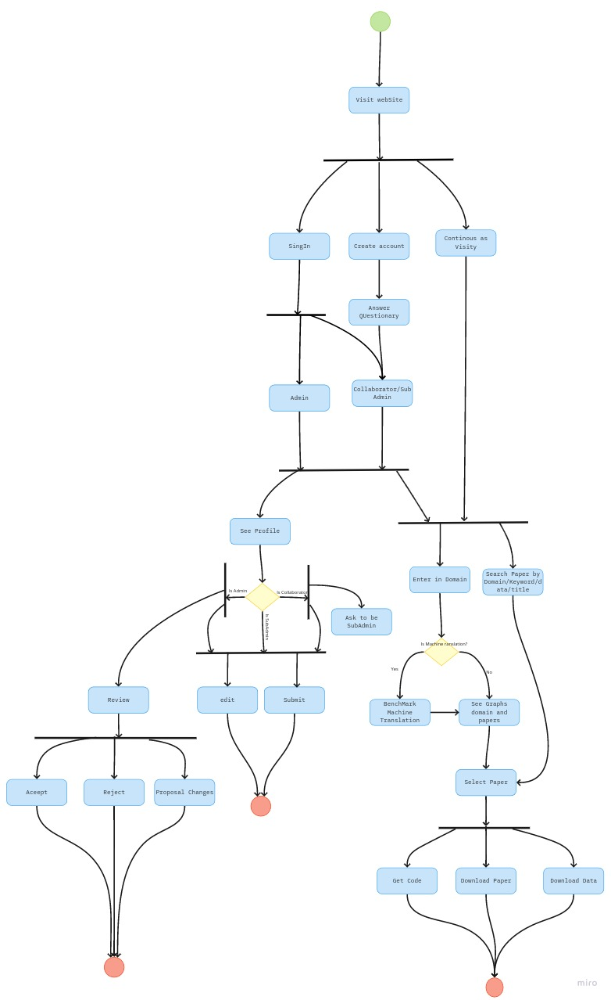

# Activy Diagram

Activity diagram is UML behavior diagram which shows flow of control or object flow with emphasis on the sequence and conditions of the flow. The actions coordinated by activity models can be initiated because other actions finish executing, because objects and data become available, or because some events external to the flow occur.

The next flow show the flow from different users in the webSite.

---
## References
---

- **[WebSite]** <a href="https://www.uml-diagrams.org/package-diagrams-overview.html">UML site</a>

- **[Moodle]** Serrano, Milene. Vídeo Aula : Diagrama de Atividades

---

## Document Versioning

| Date | Author(s) | Description | Version |
|------|-------|-----------|--------|
| 25/09/2020 | Mikhaelle Bueno | Document creation and Add Diagram | 0.1 |