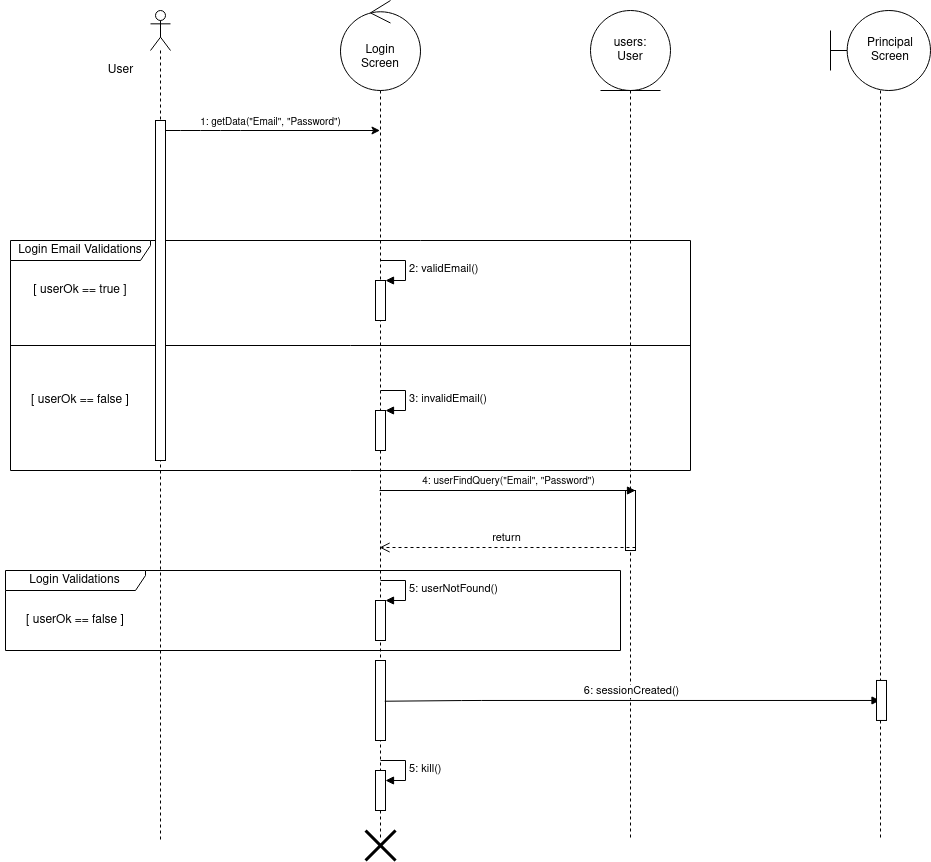

#
# **<a href="#dc">Sequence Diagrams</a>**

The sequence diagram is one of the diagrams of uml modeling that has dynamic character, that is, it is a behavioral diagram. It is one of the most popular diagrams, and it aims to demonstrate the exchange of messages between the defined entities, this exchange takes place over a lifeline and has several notations typical of the sequence diagarama to make a visual demonstration of how these exchanges happen.

## User SignUp

The diagram below dynamically exemplifies how the user flow will behave.

- User SignUp - version 1

## User Authentication

The diagram below dynamically exemplifies how the user flow will behave.

- User Authentication - version 1

- User Authentication - version 1.2

## Paper Submission

The diagram below dynamically exemplifies how the paper submission flow will behave.

- Paper submission - version 1

# Tracking Requirements

| Source | Destiny |
|------|-------|
|  [Prototype](../../../base/designSprint/prototype.md) | User authentication and Paper submission |
| [Backlog - User](../../../base/requirements/modeling/backlogEpics/dataCreation.md) [Prototype](../../../base/designSprint/prototype.md) | User authentication and Paper submission |

---
## References
---

- **[Moodle]** Serrano, Milene. Vídeo Aula : Modelagem, Diagrama de Classe, Dependência & Associação, Classe Concreta & Abstrata & Sobrescrita & Sobrecarga, Agregação & Composição, Herança & Realização
- **[Moodle]** Serrano, Milene. Vídeo Aula : Diagrama de sequencia
- **[WebSite]** <a href="https://www.uml-diagrams.org/sequence-diagrams.html">UML site</a>

---

## Document Versioning

| Date | Author(s) | Description | Version |
|------|-------|-----------|--------|
| 09/21/2020 | Mikhaelle Bueno | Document creation | 0.1 |
| 09/25/2020 | Lorrany Azevedo | Adding description | 0.2 |
| 09/25/2020 | Lorrany Azevedo | Adding User authentication diagram | 0.3 |
| 09/25/2020 | Lorrany Azevedo | Adding paper submission diagram | 0.4 |
| 09/25/2020 | Lorrany Azevedo | Adding tracking | 0.5 |
| 09/25/2020 | Ygor Galeno     | Adding old versions of diagram | 0.6 |
