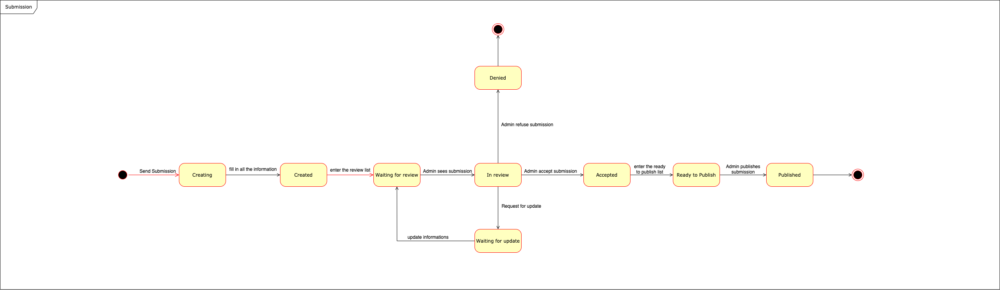

#
# **<a href="#dc">State Machine</a>**

Behavioral state machine is specialization of behavior and is used to specify discrete behavior of a part of designed system through finite state transitions. The state machine formalism used in this case is an object-based variant of Harel statecharts.

## Paper Submission

The diagram below dynamically exemplifies the states of a paper submission.

- Paper submission - version 1
- 

---
## References
---

- **[Moodle]** Serrano, Milene. Vídeo Aula : Diagrama de estado
- **[WebSite]** <a href="https://www.uml-diagrams.org/state-machine-diagrams.html">UML site</a>

---

## Document Versioning

| Date | Author(s) | Description | Version |
|------|-------|-----------|--------|
| 25/09/2020 | Guilherme Deusdará | Document creation | 0.1 |
