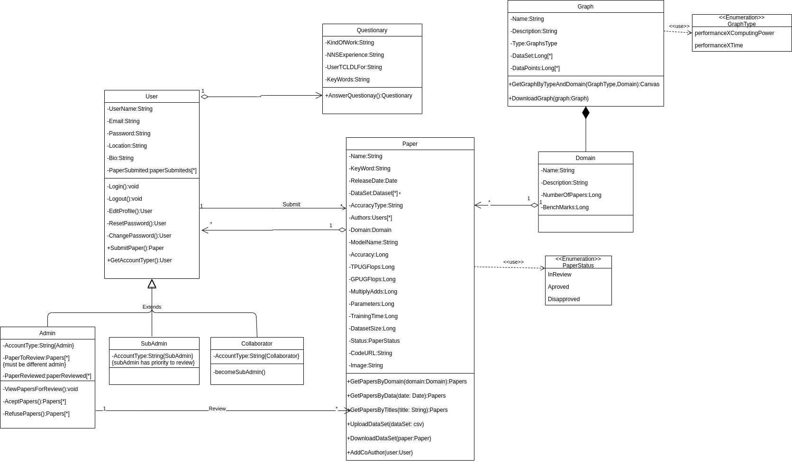

# Class Diagrams

In Object Oriented Programming, classes are fundamental to the execution of the paradigm. UML created the Class Diagram to facilitate the understanding and design of the software, showing its properties, methods and relationships.

# Back-end

The back-end will be built by services made with the Express microframework in NodeJs, using JavaScript language and Hexagonal architecture. Each of the microservices has a corresponding diagram.

## Mail Service

## Cron Service

## Upload Service

## Paper Service  

- [Version 1](./images/classDiagramV1.md)

- Version 2

### Tracking Requirements

| Source | Destiny |
|------|-------|
|  [Prototype](../../base/designSprint/prototype.md) | Questionary |
| [Backlog - User](../../base/requirements/modeling/backlogEpics/dataCreation.md) [Prototype](../../base/designSprint/prototype.md) | User |
| [Lexicos - Domain](../../base/requirements/modeling/lexicons.md) / [Prototype](../../base/designSprint/prototype.md) | Domain |
| [Prototype](../../base/designSprint/prototype.md) / [Storyboard](../../base/requirements/elicitation/storyBoard.md) | Paper |
| [Backlog - Graph](../../base/requirements/modeling/backlogEpics/dataVisualization.md) | Graph |

# Search Service

---
## References
---

- **[Moodle]** Serrano, Milene. Vídeo Aula : Modelagem, Diagrama de Classe, Dependência & Associação, Classe Concreta & Abstrata & Sobrescrita & Sobrecarga, Agregação & Composição, Herança & Realização

---

## Document Versioning

| Date | Author(s) | Description | Version |
|------|-------|-----------|--------|
| 19/09/2020 | Mikhaelle Bueno | Document creation | 0.1 |
| 21/09/2020 | Mikhaelle Bueno | Add Diagram| 0.2 |
| 24/09/2020 | Mikhaelle Bueno | Add Diagram | 0.3 |