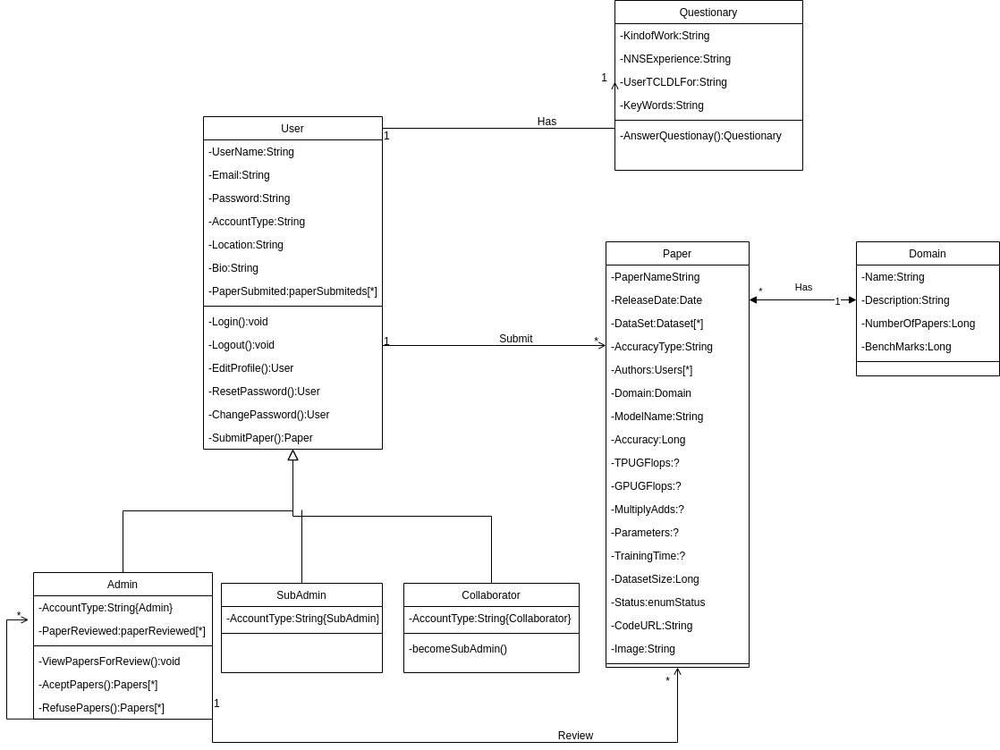

# Class Diagrams - Overview - Version 1

# Tracking Requirements

| Source | Destiny |
|------|-------|
|  [Prototype](../../../base/designSprint/prototype.md) | Questionary |
| [Backlog - User](../../../base/requirements/modeling/backlogEpics/dataCreation.md) [Prototype](../../../base/designSprint/prototype.md) | User |
| [Lexicos - Domain](../../../base/requirements/modeling/lexicons.md) / [Prototype](../../../base/designSprint/prototype.md) | Domain |
| [Prototype](../../../base/designSprint/prototype.md) / [Storyboard](../../../base/requirements/elicitation/storyBoard.md) | Paper |

## Document Versioning

| Date | Author(s) | Description | Version |
|------|-------|-----------|--------|
| 21/09/2020 | Mikhaelle Bueno | Document creation | 0.1 |